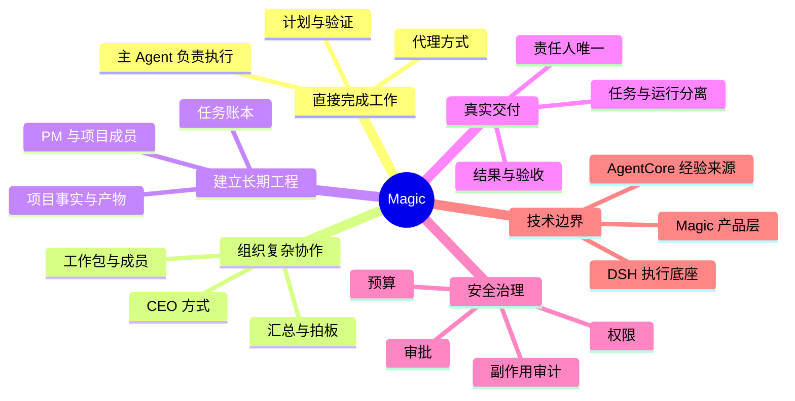
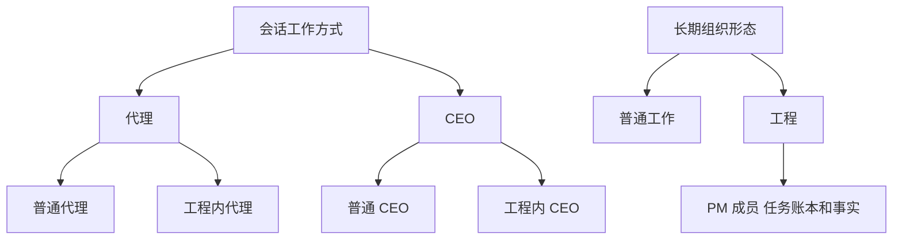
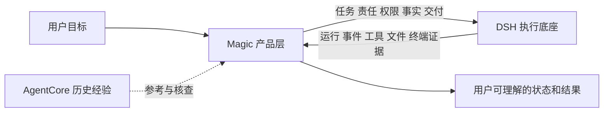
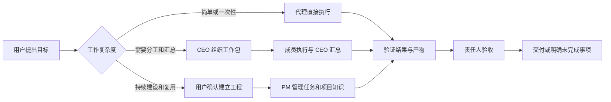
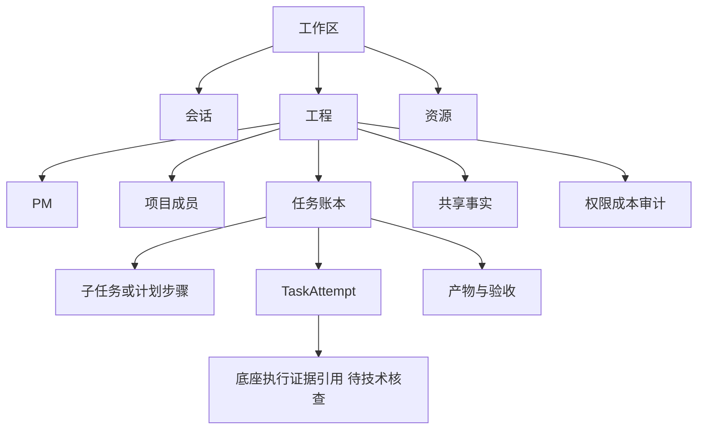

# PRD-01 Magic 产品总览

## 1. 文档定位

本文是 Magic 产品根基，统一说明产品为什么存在、服务谁、核心心智、边界、首版范围和成功标准。其他 PRD 只能展开本文定义，不能重新定义产品定位或对象边界。

## 1.1 一张图看懂 Magic

图中六个分支是同一个产品的不同观察角度，不是六个独立模块。用户可以先直接做事，只有在确实需要时才展开协作或建立工程。

## 2. 产品定义

Magic 是建立在 DSH 之上的统一 AI 工作台。DSH 提供 Agent 执行、工具、文件、终端、底层会话和运行能力；Magic 在其上建立用户可理解的工作方式、长期工程组织、任务账本、责任体系、信息共享、权限治理和真实交付。

产品承诺不是“拥有更多 Agent”，而是让不同复杂度和持续周期的工作在同一个工作台中自然连续：

> 简单的事，直接做；复杂的事，组织做；长期的事，建成一支可持续工作的 Agent 团队。

## 3. 用户问题与价值

### 3.1 直接工作

用户不想先学习 Multi-Agent、角色、DAG 或审批流程，只希望交代一个目标并得到真实结果。Magic 应让代理承担理解、拆解、执行、验证和交付，内部协作不转化为用户管理负担。

### 3.2 复杂工作

当任务需要分工、依赖、交叉验证、汇报和拍板时，用户可以主动让主 Agent 以 CEO 方式组织团队。用户关注目标、关键进度、风险和结果，而不是逐项调度工具。

### 3.3 长期工程

当工作持续多轮、需要稳定职责和项目知识时，用户可以确认建立工程。工程拥有 PM、项目成员、任务账本、资源、事实、产物和治理记录，但不会因任务复杂或 Agent 增多而自动创建。

## 4. 产品模型

Magic 有两个可组合维度，不是三个互斥等级：

这张组合图说明两个维度可以独立选择：使用 CEO 不等于建立工程，建立工程也不强迫每次都使用 CEO。

| 维度 | 选项 | 决定什么 |
|---|---|---|
| 会话工作方式 | 代理 / CEO | 当前会话主 Agent 直接执行，还是显式组织协作 |
| 长期组织形态 | 普通工作 / 工程 | 是否拥有 PM、长期成员、项目事实和持续治理 |

合法组合包括：普通代理、普通 CEO、工程内代理、工程内 CEO。用户可以永远只用普通工作，也可以先代理后 CEO，再在明确确认后建立工程。

## 5. 产品边界

### 5.1 Magic 负责

- 工作方式选择、建议和切换；
- 工程、PM、项目成员和任务关系；
- Magic 自有任务、责任、计划、状态、产物和事实账本；
- 结果回传、信息访问、权限、成本和外部副作用治理；
- 跨模式的身份、记忆、工作区和产物连续性；
- 面向用户的真实状态和交付体验。

### 5.2 DSH 负责

- Agent 的底层执行、工具调用、文件和终端工作流；
- 底层 Session、输入/响应、事件和执行证据；
- 底层协议、服务和客户端能力。

DSH 的 Session、Agent、事件和工具 approval 不能直接替代 Magic 的任务、工程、PM、责任、事实、产物和组织授权。具体绑定关系必须以锁定版本的源码、实验和实机证据为准。

## 6. 长期不变量

1. 用户可以直接开始，系统建议不能变成强制升级。
2. 代理和 CEO 平等；调用多个 Agent 不自动进入 CEO。
3. 工程是长期组织，不是文件夹、大型聊天或 Agent 数量的别名。
4. 临时 Agent、会话成员、项目成员、会话主 Agent、PM、Agent 身份和运行实例分开。
5. 工作区、文件夹、资源、会话、任务、回合、运行、事实和产物分开。
6. 每个正式任务任一时刻只有一名当前责任人。
7. 任务状态和运行状态分离；运行成功不等于任务完成。
8. 失败、等待、停止、取消和部分完成必须诚实呈现。
9. 共享文件不等于共享私有记忆、权限或项目事实。
10. 长期身份、工程建立、权限扩大、跨边界共享和持久化事实必须可见、可审计、可撤销。
11. 取消运行不撤销已经发生的文件写入、命令、付费或外部副作用。
12. 不承诺执行中任意无损切换；无法无损时必须说明影响并提供替代路径。

## 7. 端到端用户旅程

### 场景 A：一次直接任务

用户提出目标 → 代理生成计划并执行 → 用户补充约束或批准高风险动作 → 代理验证 → 用户获得文件、结果、测试和未完成事项。

### 场景 B：一次复杂协作

用户选择或建议接受 CEO → 主 Agent 明确分工和责任 → 成员并行执行 → CEO 收集结构化结果、处理冲突和阻塞 → 用户在关键决策点介入 → CEO 形成统一交付。

### 场景 C：长期工程

用户确认建立工程 → 配置 PM 和少量成员 → PM 建立任务与任务会话 → 成员执行并回报 → PM 维护计划、事实、资源和风险 → 用户查看工程进度或直达成员 → 工程完成、暂停或归档。

## 8. 首版范围

- 单用户、单工作区、单工程；
- 先用一名 PM、1 名正式项目成员、1 个 Git 主资源和 1 个独立 worktree 验证最小闭环；闭环稳定后再扩展到 2 至 4 名项目成员；
- 代理和 CEO 两种会话工作方式；
- 任务、子任务、计划、责任人、任务会话、运行、产物和项目事实；
- 用户直达成员、新任务入账、PM 通知和计划影响判断；
- 等待、失败、部分完成、停止、取消、归档、重开和断连恢复；
- 权限确认、预算记录、资源变更和冲突可见；
- 至少一个真实工程场景的完整交付闭环。

## 9. 明确不做

多层 PM、无限层级团队、跨工程成员直接调用、自动建立完整团队、永久在线 Agent、全量私有记忆共享、完整圆桌、多人实时画布、复杂多组织权限、成员市场和任意无损重编排。

## 10. 产品成功标准

| 维度 | 成功表现 |
|---|---|
| 易开始 | 用户无需先理解编排即可完成任务 |
| 低管理 | 内部协作由 Agent 处理，用户只处理关键决策 |
| 可理解 | 用户随时知道谁负责、做到哪里、结果在哪里、是否需要介入 |
| 可信赖 | 状态、失败、权限、副作用和交付证据真实可追踪 |
| 可持续 | 用户完成一次工程后愿意复用 PM、成员和项目知识 |

## 11. 变更规则

任何新增功能必须说明：服务哪个用户问题、属于哪个维度、改变哪些对象和状态、增加什么管理负担、首版是否纳入、如何验收。若不能归入本 PRD 或其他四份 PRD，应先修改现有 PRD 结构，不得直接创建第六份平行产品文档。

其他正式产品定义见：[PRD-02](PRD-02-代理与CEO工作方式.md)、[PRD-03](PRD-03-工程组织与协作.md)、[PRD-04](PRD-04-任务执行与治理.md)、[PRD-05](PRD-05-权限成本事实与副作用.md)。

## 12. 给用户看的完整故事

用户第一次打开 Magic，不需要先创建团队、选择职业角色或理解底层会话。用户只需要说：“帮我把这个项目做完。”如果事情简单，代理直接开始；如果任务需要分工，用户可以说：“这次请你按 CEO 方式组织。”如果工作会持续数周，用户可以说：“把它建立成一个工程。”三种选择都从当前目标继续，不要求用户重新复制上下文。

工作过程中，用户随时能回答五个问题：现在在做什么、谁负责、系统在等什么、已经产生了什么结果、下一步需要我决定什么。会话本身就是 Agent 的实时工作现场，应展示可理解的思考说明、计划、工具调用、文件变化、协作派发、测试和结果；未经整理的原始内部推演不作为产品展示承诺。

信息按工作表面分层：会话负责呈现当前 Agent 的连续工作过程；侧边导航负责切换会话、工程和正在进行的工作；检查器或临时面板负责查看当前选中的文件、Diff、产物、审批或子会话；工程总览和团队视图按需打开，不做成一个长期承载所有信息的万能 Tab。无论放在哪个表面，失败、同步缺口、预算超限、权限拒绝或不可逆副作用都不能被隐藏。

计划是所有工作方式都可使用的任务级能力。一个代理可以自己列计划并逐步执行，不需要因为想展示进度就创建 CEO 或增加 Agent。只有步骤需要独立责任、独立交付、独立验收、独立等待、重试或跨成员依赖时，才升级成正式子任务。

## 13. Magic 的对象全景（只做一次定义）

Magic 对象负责产品意义和最终收口；DSH 的 Session、输入/响应、事件、实际执行对象和工具结果只负责底层执行证据。具体对象是否可被一个 Magic Attempt 关联、以及关联基数，均待技术核查。任何“已完成”都必须由 Magic 任务责任人基于结果和验收确认。

## 14. 结论等级

- **已确认产品规则**：本 PRD 第 4、6、8 节中的长期边界。
- **首版建议**：本 PRD 第 8、9 节的单工程最小闭环；先用 1 名成员验证，再扩展到 2 至 4 名成员。
- **待用户裁定**：未来多用户、多层 PM、跨工程成员和组织演化。
- **待技术核查**：Magic 对象与 DSH Session 的绑定、断连恢复和底座权限能力。

证据来源：当前 Magic 产品裁定、系统边界底图、核心对象模型、模式专题、U-09/U-10/U-11/U-12 规则和三轮技术评审记录。历史材料仅用于追溯，不代表底座已支持。

## 15. 前端、后端和用户的共同合同

前端必须把模式、作用域、责任人、任务状态、等待原因、结果、产物、审批、预算和副作用展示出来；后端必须维护 Magic 自有对象 ID、状态、唯一责任约束、审计和最终收敛；用户必须能用白话理解自己能做什么、谁负责、需要决定什么以及哪些变化不可撤销。

## 16. 统一名词（大白话版）

| 名词 | 大白话解释 | 不是什么 |
|---|---|---|
| 工作区 | 用户放文件、会话和工程的范围 | 不是一个工程 |
| 资源 | 可以被读取、修改或引用的文件、仓库或外部系统 | 不是 Agent |
| 会话 | 围绕一件连续工作的交流空间 | 不是一次运行 |
| 任务 | 有目标、负责人和最终结果的一项工作 | 不是一条消息 |
| 回合 | 一次输入和响应 | 不是任务完成 |
| 运行 | 底层真正执行了一次 | 不是产品交付 |
| Agent 身份 | 可以被识别、授权和复用的参与者 | 不是某个模型进程 |
| 会话成员 | 某 Agent 在一个会话中的持续关系 | 不是所有工程成员 |
| 项目成员 | 某 Agent 在一个工程中的长期关系 | 不是角色模板 |
| PM | 负责工程计划和协调的人/Agent | 不是所有任务的负责人 |
| 产物 | 用户可以访问、验证和使用的结果 | 不是模型说“好了” |
| 事实 | 项目认可的一条可追溯信息 | 不是任意文件内容 |
| 审批 | 用户对某项动作的明确授权 | 不是永久提权 |
| 副作用 | 写文件、执行命令、花钱、发布等真实影响 | 不是普通文本回复 |

## 17. 全局产品规则的写法

后续所有需求必须使用以下句式，避免只写口号：

> 当【谁】在【什么前提】下提出【什么目标】时，系统【创建/更新什么对象】，向用户显示【什么信息】，由【谁】承担责任；系统可以自动做【哪些动作】，遇到【哪些条件】必须暂停询问；最终以【什么证据】判定完成，失败、等待、取消、断连和副作用按【什么规则】收口。

示例：当用户让 CEO 组织一次架构评审时，系统创建一个任务和两个工作包，显示成员职责、预计成本和截止条件；CEO 负责汇总，成员负责各自结果；遇到生产写入或预算超限必须暂停询问；最终以评审文档、验证记录和未决风险作为交付证据，不能以成员运行成功代替任务完成。

## 18. 版本和证据纪律

每个产品结论都标记为：

- **已确认产品规则**：用户已经明确认可，前后端不得自行改变。
- **首版建议**：为了验证价值而限定的范围，后续可以扩展。
- **待用户裁定**：技术可以给方案和代价，但不能替用户选择。
- **待技术核查**：必须使用锁定版本、源码、实验或实机证据确认。
- **历史讨论**：只说明结论如何形成，不代表当前规则。

外部项目中存在代码、测试或历史做法，只能说明“可能继承”或“需要适配”，不能直接写成 Magic 已支持。产品 PRD 的日期、版本、负责人和证据链接必须随结论一起维护。

## 19. 产品根基的验收

当产品、前端、后端和用户对以下问题给出相同答案，才算 PRD 可用：

1. 用户第一步可以做什么？
2. 什么时候用代理，什么时候用 CEO，什么时候建立工程？
3. 谁对每项任务负责？失败和等待时责任是否仍然清楚？
4. 用户能看到什么，哪些内部细节可以折叠？
5. 哪些动作会暂停询问，预算和权限如何显示？
6. 文件、事实、产物和运行分别如何记录？
7. 断连、重试、停止、取消和副作用如何收口？
8. 首版做什么，明确不做什么，什么证据才允许进入开发？

## 20. 为什么一定要做 Magic

现有 Agent 工具已经能写代码、查资料、改文件和执行命令，但用户仍然会遇到四个断点：简单事情也要先做很多编排；任务复杂后不知道谁负责；临时 Agent 的有效工作无法自然复用；底层运行停止后无法判断事情是否真的完成。Magic 的价值不是增加更多 Agent，而是把“开始工作、组织协作、持续建设、真实交付”连接成一条用户能理解的链路。

## 21. AgentCore 的位置

AgentCore 的历史实践可以提供协作、状态和恢复方面的经验，但它不是 Magic 首版必须经过的生产运行层。首版优先验证 DSH 执行底座与 Magic 产品层的边界；是否把 AgentCore 某项能力纳入生产链路，必须同时满足技术证据和实际收益，不能因为旧项目有过实现就自动继承。

## 22. 用户选择参考表

| 用户面对的事情 | 推荐入口 | 用户听得懂的解释 |
|---|---|---|
| 一个明确的小问题 | 代理 | “你直接帮我做完。” |
| 一次工作需要多种专业判断 | CEO | “你组织几个人帮我完成这一轮。” |
| 项目会持续很久 | 工程 | “给这个项目建立一支长期团队。” |
| 任务步骤很多 | 计划 | “告诉我分几步、现在到哪一步。” |
| 可能影响重要资源 | 审批 | “关键动作先问我。” |

这张表是帮助用户选择的提示，不是强制流程。用户说“直接做”“这次用 CEO”“建立工程”“分步骤做”“删除前先问我”，系统都应直接理解并记录对应的意图。

## 23. 完整白话案例：从代理成长为工程

用户说：“帮我做一个产品官网，先给我一个能运行的版本。”代理直接读取项目、创建页面、运行检查并交付初版。用户接着说：“继续写之前，用 CEO 方式找产品和视觉专家判断方向。”当前会话保留上下文，CEO 创建两个临时协作任务，收回建议后统一汇总。用户再说：“这个官网要长期迭代，建立一个工程，先安排 PM、前端和测试。”系统展示工程目标、成员职责、资源、权限和预计成本，用户确认后才建立长期关系。

之后用户对 PM 说：“新增多语言需求，但不要影响本周发布。”PM 把新需求写入工程任务账本，判断它与当前发布的依赖关系，将多语言排到下一阶段，同时让本周发布继续。如果前端成员直接发现一个阻塞并联系用户，系统也会把这次直达工作入账并通知 PM。最终交付页要告诉用户谁负责、改了哪些文件、测试是否通过、哪些结果已验收、哪些风险仍待决定。

## 24. 后续产品路线

| 阶段 | 重点 | 进入条件 |
|---|---|---|
| P0 | 产品语言、对象边界、首版范围 | 本 5 份 PRD 无冲突 |
| P1 | DSH 底座与运行事实 | 版本、runtime、协议可复现 |
| P2 | 任务、责任、状态和结果契约 | F-10 组合方案评审通过 |
| P3 | 单工程最小闭环 | 首版场景和 F-10 验收通过 |
| P4 | CEO、成员复用、资源治理增量 | 有真实用户价值和技术证据 |

任何阶段都不能把后续方向写成首版已支持；每次扩展都要说明减少了什么用户负担、增加了什么管理复杂度和如何验收。
