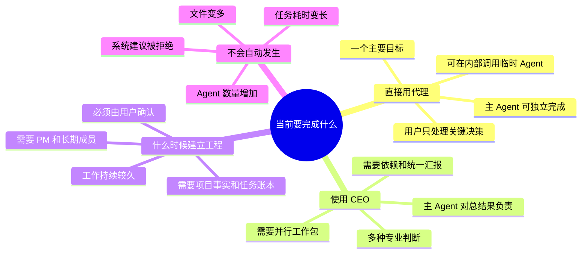
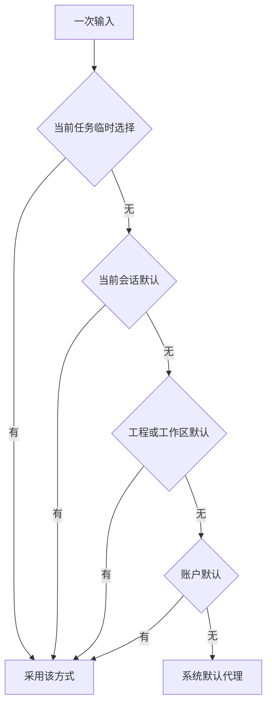
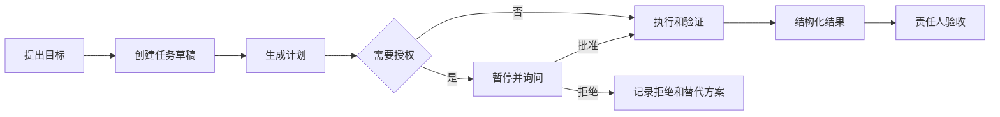
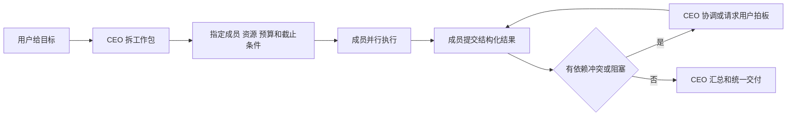
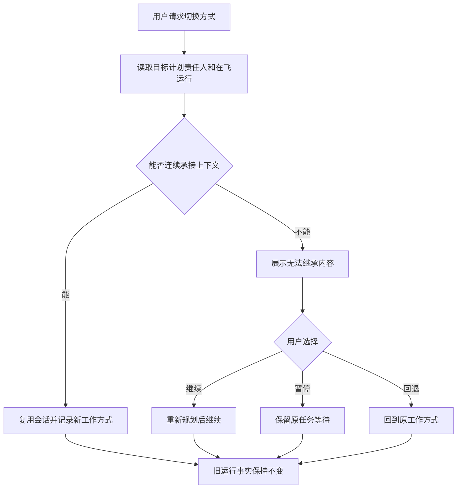
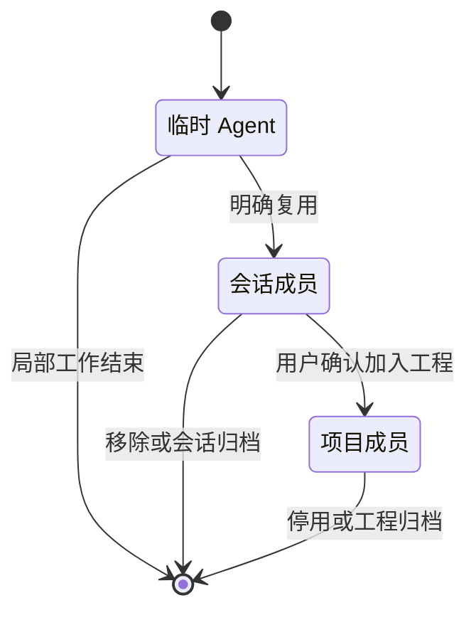

# PRD-02 代理与 CEO 工作方式

## 1. 目标

让用户在不理解内部 Agent 编排的前提下开始工作，并在需要时主动展开团队协作；工作方式改变不能丢失目标、上下文、产物和责任。

## 1.1 代理和 CEO 怎么选

## 2. 代理方式

用户直接提出目标，主 Agent 负责理解、计划、执行、工具调用、验证和交付。主 Agent 可以自主拆解、调用临时 Agent 或复用当前会话成员，但这些内部行为不改变产品模式，也不要求用户管理成员。

默认体验：输入目标 → 执行 → 展示关键进度 → 请求必要决策 → 验证 → 真实交付。

## 3. CEO 方式

用户把目标交给当前会话主 Agent，由主 Agent 承担分工、依赖、汇报、阻塞处理和统一交付责任。CEO 可以创建或复用完整 Agent 会话；成员是可工作的 Agent，不是弱化工具。

用户看到的是目标、成员职责、任务进度、阻塞、关键决策和最终汇报；底层调用细节默认折叠，风险和待用户决策不能隐藏。

## 4. 三种操作必须区分

| 操作 | 作用范围 | 结束后 |
|---|---|---|
| 代理内部调用协作者 | 当前任务内部 | 不改变模式或长期成员关系 |
| 当前任务启用 CEO | 单次任务 | 默认回到原会话工作方式，成员可按规则保留 |
| 修改会话默认方式 | 当前会话后续任务 | 影响后续入口，不追溯改写已完成任务 |

进入工程模式是独立操作，必须明确确认，不因使用 CEO 自动发生。

## 5. 切换规则

切换前必须显示：目标、未完成任务、当前责任人、在飞运行、已产生副作用、成员关系和可能丢失的上下文。能连续承接时复用原会话；不能无损承接时提供继续、暂停、重新规划或回退选项。

用户拒绝系统建议后，当前工作继续按原方式进行。系统建议永远是非阻塞的。

## 6. 验收场景

- 用户用代理完成一个直接任务。
- 代理内部调用临时 Agent，任务结束后不产生长期成员。
- 用户将单次任务切换为 CEO，目标和产物连续，完成后可回到代理。
- 用户在 CEO 中查看成员进度，不需要逐项管理，但可以处理阻塞和拍板。
- 代理与 CEO 切换时，失败、等待、停止和部分完成不被改写。

## 7. 非目标

不强制复杂任务升级 CEO；不以 Agent 数量、耗时或文件数量自动升级；不把 CEO 做成永久组织；不要求用户先配置角色、编排流程或团队结构。

## 8. 默认值和作用域

工作方式默认按以下优先级生效：**当前任务临时选择 > 当前会话默认 > 工程/工作区默认 > 账户默认 > 系统默认**。高优先级只决定工作方式，不会扩大权限、预算或资源范围。输入已经排队时，模式归属于该条输入；不能用后来修改的默认值追溯改写旧任务。

## 9. 代理流程（白话契约）

| 环节 | 系统行为 | 用户看到 | 责任与记录 |
|---|---|---|---|
| 用户提出目标 | 创建任务草稿并识别资源范围 | 目标、默认模式、预计影响 | 创建者暂时负责，记录输入 |
| 开始执行 | 生成计划，必要时调用临时 Agent | 当前步骤和预计等待 | 任务责任人保持不变 |
| 需要授权 | 暂停相关 Attempt | 要做什么、影响什么、预算和选项 | Approval 记录主体、范围和有效期 |
| 产生结果 | 汇总验证和产物 | 完成、未完成、证据、风险 | 责任人验收，不以 Run 成功代替 |
| 无法完成 | 进入等待、部分完成或失败 | 原因、已发生变化、可选下一步 | 保留历史，允许明确重开 |

代理内部调用临时 Agent时，临时 Agent拥有完成局部工作的完整能力，但默认不保留为会话成员；若用户或系统希望复用，必须显式转为会话成员并记录归属、权限、记忆和责任变化。

## 10. CEO 流程（白话契约）

CEO 先把目标拆成可解释的工作包，再给每个工作包指定责任人、输入、资源、截止条件和预算。成员独立工作后必须返回结构化结果：状态、完成内容、未完成内容、产物、验证依据、风险/阻塞、下一步和待用户决策。CEO 负责汇总、处理依赖、识别冲突和统一交付，但不能把成员失败改写成成功。

用户可以在任何阶段插话。插话本身生成新任务并进入任务账本；如果影响原目标、资源、预算或交付，CEO必须给出计划影响判断。用户最新指令优先，但不会静默取消已经在执行的任务。

## 11. 切换与异常

切换只改变新一轮工作方式，不改写已经完成或正在运行的底层事实。切换前显示：目标、计划、当前责任人、在飞 Attempt、已产生副作用、成员关系、待审批和无法继承的上下文。能连续承接时复用会话；不能连续承接时提供继续、暂停、重新规划或回退。

| 异常 | 必须表现 |
|---|---|
| 排队中切换 | 新输入按新模式，旧输入保持原模式 |
| 执行中切换 | 旧 Attempt 保持原事实，不承诺无损重编排 |
| 断连 | 显示同步缺口，重连后补齐事件，不猜测成功 |
| 停止 | 只阻止后续动作，已发生副作用照实显示 |
| 失败/部分完成 | 责任人仍在，用户可重试、降级、验收或取消 |
| 用户拒绝建议 | 继续原方式，系统不重复打扰 |

## 12. 验收与结论等级

【已确认产品规则】代理和 CEO 平等、系统建议非阻塞、三种操作作用域分离、切换不改写旧运行。

【首版建议】代理直接任务、单次 CEO、成员复用和插话入账。

【待用户裁定】账户级默认、未来自动建议强度和跨会话成员共享。

【待技术核查】底座事件、运行中切换、会话复用和重连能力。

## 13. 用户故事

### 故事 1：我只想把事情做完

用户说“把这份报告整理成可发布版本”。系统默认使用代理方式，显示工作目标、引用文件和计划。用户不需要选择 Agent、团队或流程；代理可以自己做检查、调用辅助 Agent，但最终由主 Agent 汇总并交付。

### 故事 2：我希望有人组织一轮专业协作

用户说“请你以 CEO 方式组织架构、产品和测试一起评估”。系统在当前会话中保留原目标和文件，创建可见的工作包和成员关系。用户能看到每个工作包的责任人、进度和阻塞，在需要拍板时收到一条明确的问题，而不是一串底层日志。

### 故事 3：我中途改变了想法

用户在执行中提出新要求。系统把新要求作为新回合和新任务记录，标记它会影响哪些旧计划；旧 Attempt 的事实不被改写。若新要求与原任务冲突，系统先暂停冲突部分并让用户选择，不擅自取消原任务。

## 14. 成员生命周期

| 类型 | 创建条件 | 可见范围 | 结束方式 | 是否保留 |
|---|---|---|---|---|
| 临时 Agent | 当前任务需要局部协作 | 当前任务的最小上下文 | 局部工作结束 | 默认不保留成员关系，保留结果和证据 |
| 会话成员 | 用户或主 Agent 明确希望复用 | 当前会话及被授权任务 | 移除、停用或会话归档 | 保留身份、历史、产物和授权记录 |
| 项目成员 | 用户确认加入工程 | 当前工程 | 停用、退出或工程归档 | 保留项目历史，默认不跨工程调用 |
| 借调成员 | 未来经用户授权的跨工程关系 | 指定任务和期限 | 到期、撤销或任务结束 | 保留借调审计，不共享完整记忆 |

角色名称只是当前任务的职责描述，不等于长期身份。一个成员可以在不同任务中担任研究、实现、评审等不同角色，但责任人和权限每次都要明确。

## 15. 前端需求

### 15.1 工作入口

- 输入框旁显示当前工作方式和作用域，例如“代理 · 当前任务”或“CEO · 当前会话”。
- 用户可以一键选择代理、单次 CEO 或修改会话默认；三者必须用不同文案说明影响范围。
- 系统建议使用非阻塞提示，提供“采用”“稍后”“不再建议”三个动作；拒绝后不重复打扰同一任务。

### 15.2 过程视图

- 会话是两种方式共同的实时工作现场：代理和 CEO 都应在会话中显示可理解的思考说明、计划、工具调用、文件变化、测试、派发、回传和结果；未经整理的原始内部推演不作为产品展示承诺。
- 代理方式以当前 Agent 的连续工作过程为主，内部协作者默认按需展开；CEO 方式在会话中补充工作包、成员进度、依赖、汇报和待用户决定事项。
- 侧边导航用于切换会话、工程和进行中的工作；检查器或临时面板只显示当前选中的文件、Diff、产物、审批或子会话；工程团队总览属于按需打开的独立视图，不规定为固定万能 Tab。
- 两种方式都必须显示失败、等待、同步缺口、权限请求和不可逆副作用，不能因信息被折叠而隐藏。

### 15.3 切换确认

切换确认页必须列出：继续的目标、待完成计划、当前责任人、在飞运行、会话成员、可继承上下文、无法继承内容、已发生副作用和用户需要选择的处理方式。确认后生成一条“工作方式已改变”的系统记录。

## 16. 后端需求

- 为每条输入保存生效的工作方式、作用域、来源和时间，不依赖当前默认值回算。
- 代理内部派发、单次 CEO 和会话默认变更使用不同关系类型和审计事件。
- 切换不得删除或覆盖旧 TaskAttempt、Run、Approval、Artifact、SideEffect 或责任记录。
- 成员复用必须校验会话/工程归属、授权范围、记忆可见性和预算剩余。
- 用户插话创建新任务并记录与原任务的关联、冲突和计划影响。

## 17. 可测验收

| 前置条件 | 用户动作/系统事件 | 预期结果 |
|---|---|---|
| 普通会话、无历史偏好 | 输入直接任务 | 进入代理；创建任务、计划和责任人 |
| 代理任务执行中 | 代理调用临时 Agent | 产生独立结果；任务结束后无长期成员 |
| 代理任务已存在上下文 | 用户选择单次 CEO | 同一目标继续；创建工作包；旧运行事实不变 |
| CEO 有两个成员工作包 | 用户插话改目标 | 新任务入账；冲突部分等待用户选择 |
| 运行已产生文件写入 | 用户停止 | 后续动作停止；文件写入和副作用仍可见 |
| 连接中断 | 系统重连 | 显示同步缺口并补齐；不直接宣告完成 |

