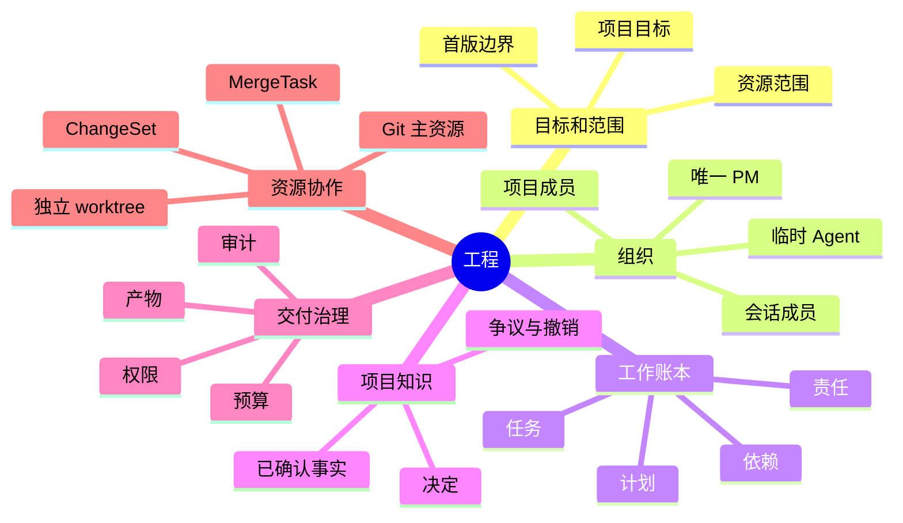
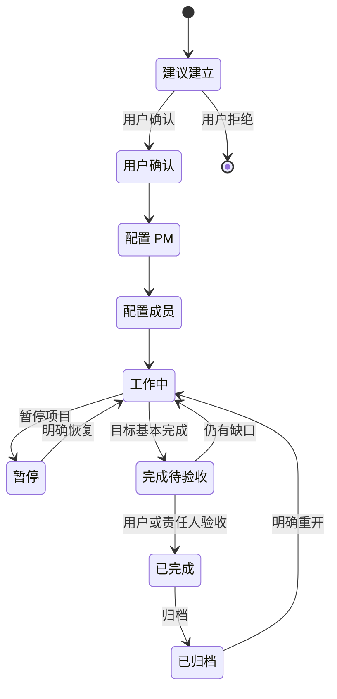
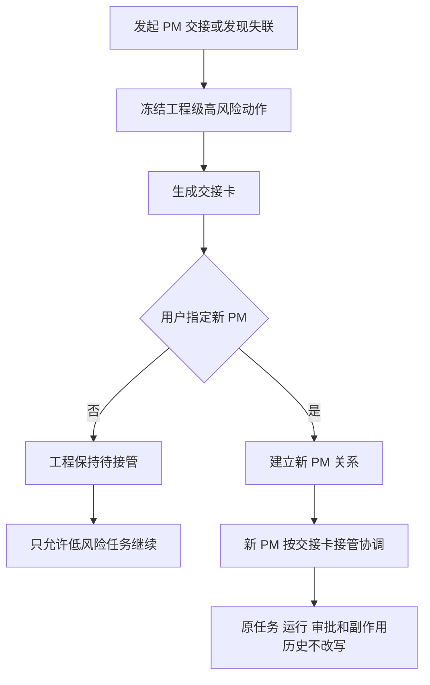
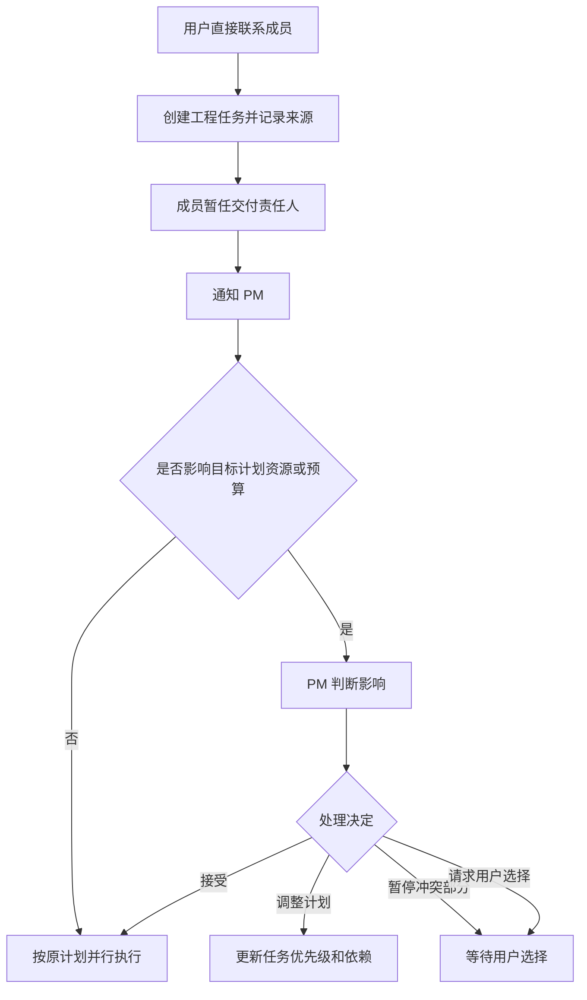
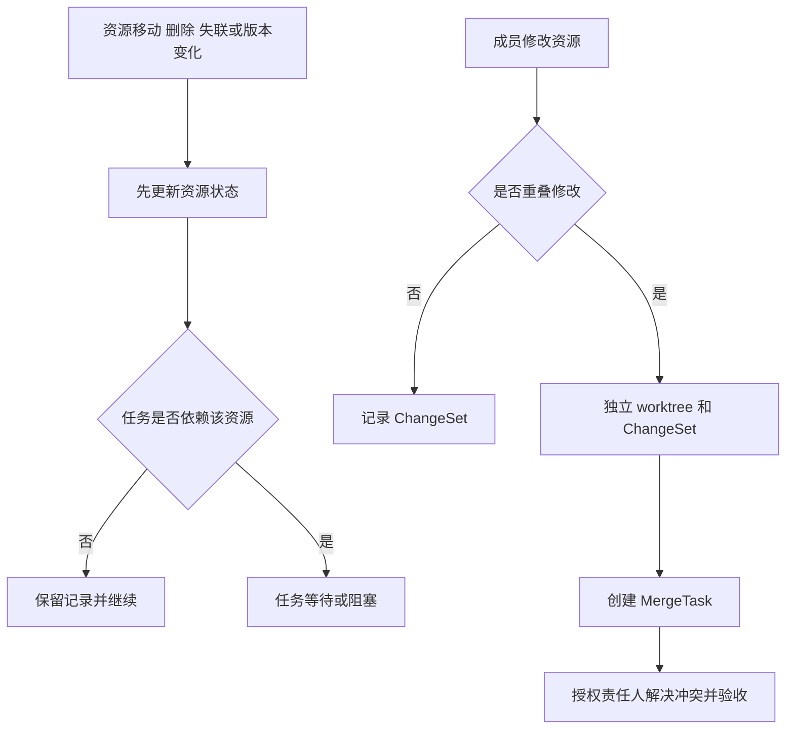

# PRD-03 工程组织与协作

## 1. 目标

为持续建设的项目提供可复用的 PM、成员、任务和项目知识，同时避免把普通会话、文件夹或大型聊天误当成工程。

## 1.1 工程全景

## 2. 工程组成

工程由用户确认建立，至少包含：项目目标、PM 关系、项目成员、任务账本、关联资源、共享事实、产物登记、权限与成本记录。工程可以关联多个资源，主资源只是默认入口。

## 3. 角色与生命周期

| 角色 | 责任 | 复用范围 |
|---|---|---|
| PM | 项目目标、计划、优先级、依赖、风险和汇总 | 一个工程；同一时刻唯一 |
| 项目成员 | 承担任务、产出结果和专业判断 | 一个工程的多个任务/会话 |
| 会话成员 | 在单个会话范围内持续复用 | 当前会话 |
| 临时 Agent | 服务局部工作 | 当前任务，默认不保留 |
| 用户直达成员 | 用户直接发起的新任务 | 必须进入工程任务账本 |

角色模板可以复用，但不复制成员身份、私有上下文、记忆或权限。首版默认不开放跨工程成员直接调用。

## 4. PM 与责任边界

PM 对工程级目标和汇总负责，不自动成为每个成员任务的责任人。每个正式任务只有一名当前责任人；PM 负责发现影响工程目标、计划、资源、预算或交付的直达任务，并决定是否调整计划。

同一工程同一时刻只有一名当前 PM。PM 交接必须记录原 PM、新 PM、时间、原因、在飞任务、待审批项、资源变更和历史责任；交接不自动改写任务、运行或审批归属。

## 5. 协作信息

成员默认共享：任务目标与约束、结构化结果、文件/产物引用、项目已确认事实和必要状态。默认不共享：私有记忆、完整上下文、未授权文件、其他工程信息和内部凭据。

共享事实必须有来源、范围、状态、版本、争议和撤销记录。文件变化不会自动成为项目事实；事实变化也不会自动宣告任务完成。

## 6. 资源与并发修改

工程支持本地文件、代码仓库和外部资源登记。代码重叠修改使用独立修改空间和 Git 变更，由授权责任人检查、解决冲突和合并。任务状态与资源变更状态分开记录。删除、发布、部署和外部写入按权限、风险和审批规则处理。

## 7. 首版验收

- 创建工程并确认唯一 PM。
- PM 先配置 1 名正式成员验证最小闭环，稳定后扩展至 2 至 4 名成员，并持续回收结构化汇报。
- 用户直达成员产生的新任务进入统一任务账本并通知 PM。
- PM 交接后，在飞任务、审批、资源变更和历史责任保持清楚。
- 两名成员同时修改同一资源时，不发生静默覆盖。
- 成员复用不会泄露未授权记忆、权限或其他工程内容。

## 8. 后置范围

多层 PM、无限团队、跨工程借调、自动组织演化、团队市场、完整圆桌、多人实时画布和多用户协作权限模型。

## 9. 工程生命周期

工程创建必须由用户确认，系统可以建议但不能因为任务复杂自动建立。工程完成不删除任务、产物、事实、成员或审计；归档后默认只读，重开必须说明恢复哪些计划、权限和责任。

## 10. PM 交接和失联

交接记录至少包含：原 PM、新 PM、生效时间、原因、项目目标、计划版本、未完任务及责任人、运行中的 Attempt、待审批、资源冲突、预算消耗、已发生副作用、风险和用户确认。交接不取消、重做、批准、合并或回退已有工作。

PM 失联时工程进入“待接管”，而不是静默创建第二个 PM。用户可以指定接管人；接管完成前，成员可继续低风险任务，但影响工程目标、资源、预算和发布的动作暂停。

## 11. 用户直达成员

用户直接联系项目成员时，系统创建工程任务并默认让该成员承担交付责任，同时通知 PM。若新任务影响工程目标、优先级、资源、预算或交付，PM必须给出“接受、调整计划、暂停冲突部分、请求用户选择”之一；通知不等于所有工作都必须等待 PM 批准。

## 12. 资源变化和并发修改

| 变化 | 系统处理 |
|---|---|
| 文件移动/重命名 | 更新资源引用；找不到时任务进入等待并提示修复 |
| 文件删除 | 保留删除记录；相关任务进入阻塞或等待，不自动完成 |
| 外部资源失联/版本变化 | 标记同步缺口，暂停依赖该资源的动作 |
| 两个成员重叠写入 | 使用独立修改空间和 ChangeSet，禁止静默覆盖 |
| 检查并合并 | 产生独立 MergeTask，由授权责任人验收并记录冲突解决 |
| 合并完成 | 资源状态变更与任务完成分开确认 |

## 13. 共享信息边界

任务上下文、结构化任务结果、文件/产物引用和已确认项目事实可以按授权共享；完整 transcript、私有 memory、NoteWall、凭据、兄弟任务细节和其他工程信息默认不共享。角色模板可复制提示和职责，不复制成员身份、历史、记忆或权限。

## 14. 前端、后端和验收

前端要有工程总览、PM/成员列表、任务账本、资源状态、交接卡和冲突合并卡；后端必须保证同一工程唯一 PM、任务责任归属、成员生命周期、资源锁定、ChangeSet/MergeTask 关系和事实版本；首版验收覆盖建工程、PM 交接、PM 失联待接管、用户直达成员、文件失联、并发修改和归档重开。

【已确认产品规则】工程需用户确认、PM 唯一、交接显式、资源多关联、用户直达入账、跨工程默认隔离。

【首版建议】先以单用户单工程、1 PM、1 名正式成员、1 个 Git 主资源和 1 个独立 worktree 验证最小闭环；闭环稳定后再扩展到 2 至 4 名成员。

【待用户裁定】多用户协作、跨工程借调、自动组织演化。

【待技术核查】底座工作树、Git、外部资源同步和并发写入能力。

## 15. 用户创建工程的完整流程

1. 用户表达“这是一个持续建设的项目”或点击“建立工程”。
2. 系统展示工程目标、默认工作区、关联资源、建议 PM、成员数量、权限和预计成本。
3. 用户确认后创建工程记录；未确认前只有建议，不产生长期 PM 或成员。
4. 用户选择一名 PM，配置少量成员和每个成员的初始职责。
5. PM 创建任务、计划和任务会话，成员开始执行。
6. PM 汇总结果、项目事实、风险和资源变更，用户查看工程进展。
7. 工程完成、暂停或归档时，系统保留历史；重开必须明确恢复范围。

## 16. 对象关系和边界

文件夹是路径，资源是可被引用的对象，工程是长期目标和组织边界，工作区是资源和会话的更大范围。它们不能因为名称相同而合并。

## 17. PM 日常循环

PM 每次收到成员结果，都要回答：完成了什么、证据在哪里、还有什么没完成、是否影响工程目标、是否需要调整优先级、是否需要用户决定。PM 只能基于结构化结果和证据汇总，不能把底座成功、文件存在或成员口头说完成当作项目完成。

## 18. PM 交接卡

交接操作必须一次性生成交接卡，包含：工程目标、当前计划版本、所有未完成任务及责任人、成员工作负载、进行中的 Attempt、等待审批、资源锁与冲突、预算上限/预留/实际/剩余、风险、已发生副作用、未决事实、原 PM、新 PM、生效时间、原因和用户确认。

交接后：原任务责任人不自动改变；审批不自动批准；资源变更不自动合并；原 PM 的历史贡献和责任保留；新 PM 从交接卡开始接管项目级协调。

## 19. PM 失联处理

如果 PM 无法继续工作，工程状态变为“待接管”。系统显示当前阻塞、可继续的低风险任务和必须等待的高风险动作。用户指定接管人后，产生新的 PM 关系和交接记录；在此之前不创建第二个隐形 PM，也不重复派发任务。

## 20. 用户直达成员的优先级规则

用户最新指令优先，但分为三类：

- 不影响原目标的补充：直接创建新任务并并行执行。
- 影响计划或资源的调整：通知 PM，PM 给出影响和新的排序。
- 与原任务直接冲突：暂停冲突部分，保留原任务和历史，要求用户选择继续原方案、采用新方案或拆分目标。

## 21. 资源详细处理

资源移动、重命名、删除、失联或版本变化都先改变资源状态，再由任务责任人判断能否继续。系统不因为文件找不到就宣布任务失败，也不因为 Git 合并完成就宣布业务任务完成。ChangeSet 负责记录实际改动，MergeTask 负责检查和合并，最终验收仍由任务责任人完成。

## 22. 可测验收

| 场景 | 必须观察到 |
|---|---|
| 建立工程 | 用户确认后才生成长期 PM 和成员关系 |
| PM 交接 | 任务、审批、预算、资源冲突和历史责任完整保留 |
| PM 失联 | 进入待接管，不生成第二 PM，不重复派发 |
| 用户直达成员 | 新任务进入工程账本，PM 获知并判断计划影响 |
| 文件被移动 | 相关任务等待修复，引用和历史仍可追溯 |
| 两成员改同一文件 | 独立 ChangeSet，冲突显式，不静默覆盖 |
| 工程归档 | 历史、产物、事实和审计仍可读；重开需明确范围 |

