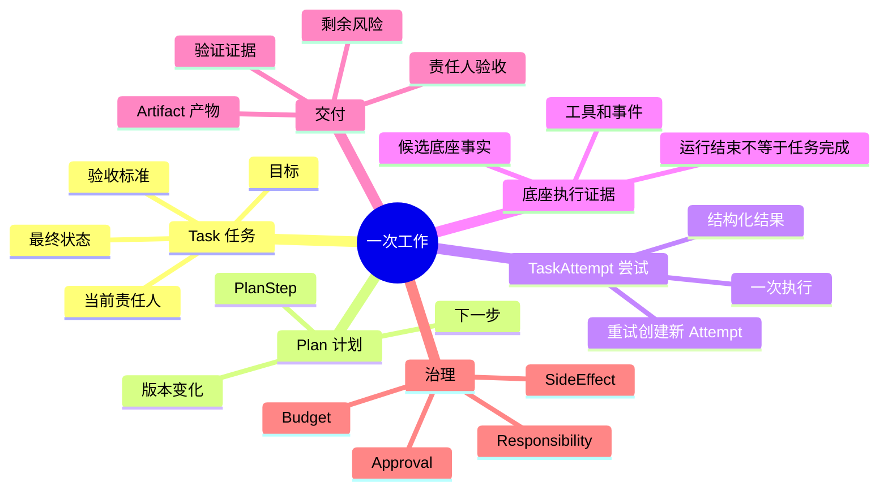
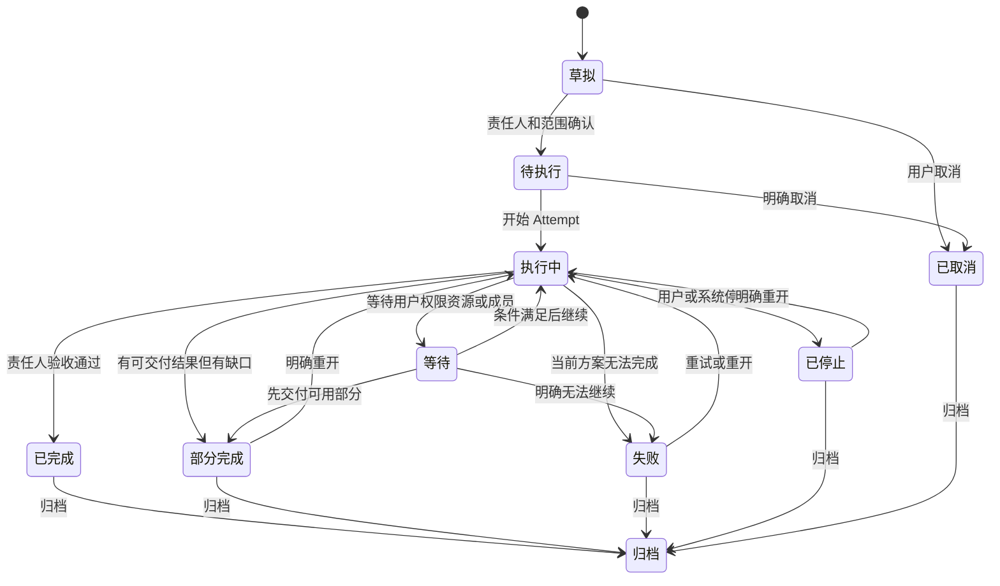
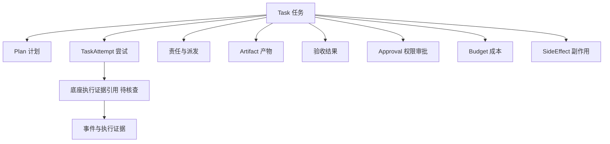
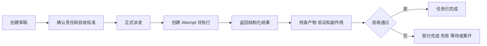
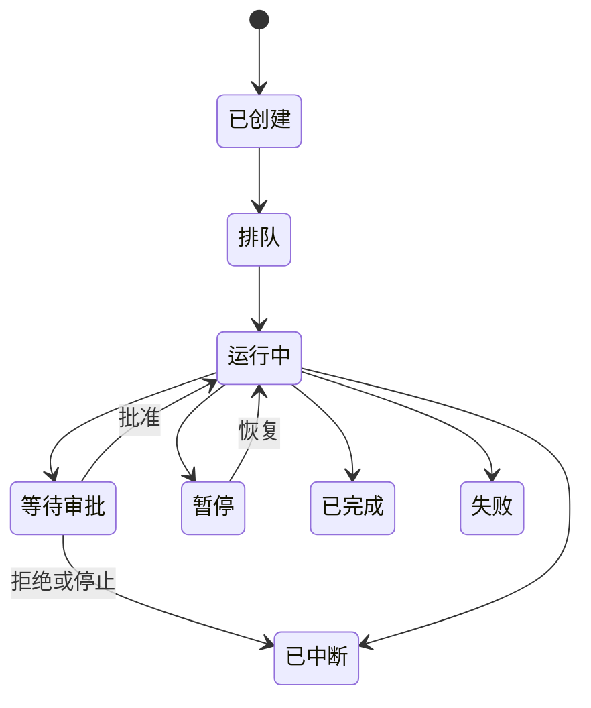
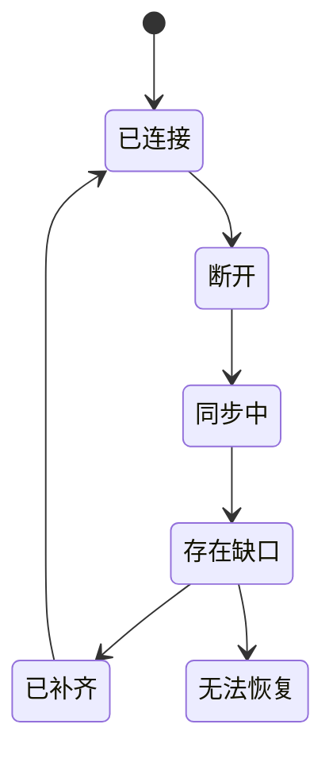

# PRD-04 任务执行与治理

## 1. 目标

建立 Magic 自有的任务账本和交付闭环，把底座运行事实、产品任务状态、责任、权限、成本和外部副作用分开管理。

## 1.1 任务、执行和交付的关系



## 2. 核心对象

| 对象 | 含义 |
|---|---|
| Task | 仅在需要独立交付、责任、验收、重试、定时或协作治理时创建的产品工作单元 |
| TaskAttempt | 受治理 Task 的一次真实执行尝试，可因重试或恢复产生多个 |
| Session / Turn | 用户默认入口：连续交流上下文及其输入响应记录；一条 Turn 不自动创建 Task |
| 底座执行证据 | DSH 的 Session、`session/follow` 日志、状态与事件；V1 直接读取这些对象，不复制 transcript |
| Artifact | 可访问、可验证、可追溯的交付结果 |
| Fact | 有来源、范围、状态和版本的项目知识 |

### 2.1 会话优先与 Task 升级边界

用户新建的是会话，用户发送的是 Turn。会话可连续执行、补充、追问和结束，不要求 Task。

只有满足至少一项时，系统才在会话内提出或创建 Task：需要独立验收或责任人、需要与其他工作协调、需要定时/后台运行、需要保留独立重试历史，或用户明确要求建立工作单。Task 创建后可引用发起它的会话和 Turn；它不能反过来取代会话的聊天历史。

V1 的 transcript 真相源是 DSH 的 `Session` 与 `session/follow` 日志。Magic 只保存它确有所有权的扩展信息和受治理 Task 事实；不得先建立平行的 `MagicSession` 或 `Turn` 存储再复制底座内容。

## 3. 任务状态



等待必须说明等待谁、等待什么、开始时间和继续方式。运行成功只说明一次尝试结束，不自动代表任务成功；取消运行不代表撤销副作用。

> **【V1 范围注记】** 本节状态图为产品完整模型。第一版（V1）以 domain 源码的 Task 8 态为准：`proposed / ready / in_progress / awaiting_review / completed / blocked / cancelled / failed`；上图的"等待、部分完成、已停止、已归档"四个状态在 V1 中延后，不在界面或接口中伪造。

## 4. 权限、成本与副作用

权限、预算、风险和有效期分别治理。用户入口可以提供：请求批准、当前范围内自动处理、完全访问当前工程三档选择，但三档入口不能突破资源边界、预算上限、高风险规则和系统禁止项。

每次高风险动作必须记录主体、资源、动作、范围、授权来源、时间、预算、审批结果和实际副作用。文件写入、命令执行、Git 合并、发布、部署、付费和外部 API 写入都必须能追溯。

## 5. 结果回传

子任务结果回到父任务时使用结构化结果：完成内容、未完成内容、证据、产物、风险、建议和需要决策的事项。父任务只能基于证据形成收口，不能把成员失败、底座成功或文件存在直接改写成任务成功。

## 6. F-10 开发准入

首次正式开发前必须锁定 DSH 版本、Profile/Bundle、实际调用入口与 Remote API contract，并证明 Magic `TaskAttempt` 与底座执行证据的最小绑定模型，能在断连、事件缺口、进程重启、重试、停止、审批和外部副作用组合场景下最终收敛。

F-10 未通过前，允许产品裁定、适配器原型和受控实验；禁止冻结完整数据库、API、完整状态机、权限模型和正式排期。

## 7. 首版验收

- 代理调用临时 Agent不会产生长期成员。
- CEO 单次协作完成后可回到代理，目标、产物和责任连续。
- PM 派发任务后，成员失败或部分完成不会被包装成成功。
- 断连、重复事件、重启和重试后任务、产物、审批和责任最终一致。
- 停止后已发生的文件写入和外部副作用准确呈现。
- 任务可归档、重开，所有状态变化有来源和时间。

## 8. 产品阶段

| 阶段 | 目标 | 状态 |
|---|---|---|
| P0 | 产品基线与对象边界 | 完成 |
| P1 | DSH 底座取证与 Adapter 接入 | 完成基础链路 |
| P2 | Magic 任务/运行/责任契约 | 待开始 |
| P3 | 单工程首切片 | F-10 前 No-Go |
| P4 | CEO、成员复用和工程治理扩展 | 后续 |

## 9. 完整对象与关系



| 对象 | 是什么 | 谁创建/结束 | 权威来源 |
|---|---|---|---|
| AgentIdentity | 可复用的 Agent 身份 | 系统/用户；停用后保留历史 | Magic 身份目录 |
| Magic 会话引用 | 指向 DSH Session 的产品入口及少量 Magic 扩展信息 | 用户/系统；归档 | DSH Session；Magic 仅补充元数据 |
| SessionMember | Agent 在某会话中的成员关系 | 主 Agent/用户；移除或归档 | Magic 成员关系 |
| ProjectMember / PM | Agent 在工程中的长期关系/协调关系 | 用户；停用/交接/归档 | Magic 工程组织 |
| MagicTask / Subtask | 产品层工作和责任单位 | 用户/PM/Agent；收口/归档 | Magic 任务账本 |
| Turn | 一次输入、响应及工具过程 | 会话；追加写入 | DSH `session/follow` 日志 |
| TaskAttempt | 一次执行尝试 | 任务责任人；完成/失败/中断 | Magic 对象 + 底座证据引用 |
| DSH Session / 执行证据 | V1 会话与执行的底座对象 | DSH；按底座语义结束 | 底座事实 |
| RootExecutionBinding | 受治理 TaskAttempt 与底座入口的绑定 | 适配层；变更可审计 | Magic 绑定记录 |
| Responsibility | 当前谁对任务收口负责 | 创建/移交；历史保留 | Magic 责任记录 |
| Assignment / Delivery / Dependency | 派发、交付和依赖关系 | 派发者/责任人；完成或解除 | Magic 关系记录 |
| Plan / PlanStep | 任务计划及步骤 | 责任人；版本化 | Magic 任务账本 |
| Artifact | 可访问、可验证、可追溯的结果 | 执行/责任人；归档/替代 | Magic 产物登记 |
| Fact / Decision / Claim | 项目知识、决定和待证主张 | 用户/获授权 PM；确认/争议/撤销 | Magic 事实账本 |
| Approval / Connection / Sync | 授权、连接和同步状态 | 系统/用户；过期/恢复/关闭 | Magic 审计与底座事件 |
| Resource / ChangeSet / MergeTask | 资源、变更集和合并工作 | Agent/授权人；合并/放弃 | 资源系统 + Magic 记录 |
| SideEffect | 已发生的写入、命令、费用和外部变化 | 动作执行时产生；不可静默删除 | Magic 审计记录 |

## 10. 任务状态和责任规则

任务状态：`草拟 → 待执行 → 执行中 → 等待 → 已完成/部分完成/失败/已停止/已取消 → 归档`。草拟任务由创建者或 PM 临时维护；正式派发前不能无人负责地执行。正式任务任一时刻只能有一个当前责任人；失败、断连、下级失败和等待不会自动换责。

责任移交必须记录原责任人、新责任人、原因、时间、目标与约束、已完成结果、未完成事项、在飞 Attempt、待审批、资源变更和副作用。PM可以汇总和协调，但不能替成员把失败改成成功。

运行状态独立为：`已创建 → 排队 → 运行中 → 等待审批/暂停/已完成/失败/已中断`。一项任务可以有多个 Attempt；每次重试必须创建新的 Attempt，不能覆盖旧运行事实。断连或事件缺口时先标记同步状态，补齐或明确未知后再收口。

## 11. 计划、结果和产物

PlanStep 只是向用户展示下一步的计划，不等于正式子任务或 Run。只有当步骤拥有独立责任人、交付物、验收条件、等待或依赖时，才升级成 Subtask。计划变更必须版本化，已完成步骤不能静默改写。

结构化结果至少包含：状态、完成内容、未完成内容、产物、验证依据、风险/阻塞、下一步和待用户决策。产物状态为：`草稿 → 待验收 → 已接受/验证失败/替代/归档`。文件存在、工具成功或底座执行结束都不能直接宣告 Task 完成。

## 12. 前端状态合同

会话是默认工作现场：用户能看到对话、计划、工具调用、文件变化、测试、结果和需要决定的事项。已建立的 Task、Attempt、产物、验证证据、预算、风险和副作用只在关联会话中显示摘要，并通过按需打开的治理视图查看；它们不能替代会话导航。底层事件仍可按需展开，但失败、同步缺口、权限拒绝、资源冲突和不可逆副作用不可隐藏。未经整理的原始内部推演不作为产品展示承诺。

## 13. F-10 组合验收

锁定 DSH 版本、Profile/Bundle、实际调用入口与 Remote API contract 后，必须先在同一证据包中确定 Magic `TaskAttempt` 对应哪些可观察底座证据，再验证：断连、重启、重试、停止、审批等待、权限变化、文件/Git/MCP/网络副作用、责任收口和产物来源。任一组合场景不能解释清楚，首次正式开发保持 No-Go。

【已确认产品规则】Magic 任务账本是真相源、对象分层、责任唯一、状态诚实、历史不可静默改写。

【首版建议】单工程最小任务闭环和 S-01 至 S-12 场景。

【待用户裁定】未来多用户任务协作、跨工程事实和复杂恢复策略。

【待技术核查】TaskAttempt 与 DSH 实际会话、输入/响应、事件和执行状态的最小绑定模型；连接恢复和工具审批事实。

## 14. 一项任务从创建到交付



### 14.1 创建

用户、PM 或 Agent 提出目标时，系统先在会话中记录原始输入、资源范围和工作方式。只有符合 §2.1 的独立治理条件时，才创建任务草稿并记录来源和临时责任人。草稿可以补充和修改，但无人负责时不能开始执行。

### 14.2 正式派发

责任人确认目标、验收标准、计划、依赖、预算和权限后，任务变为“待执行”。派发关系记录派发者、接收者、任务上下文、截止条件和可转授权限。

### 14.3 执行与结果

会话中的执行直接使用关联 DSH Session 的日志、状态和事件。只有受治理 Task 开始执行或重试时，才创建 Magic `TaskAttempt` 并关联经锁定入口确认的底座执行证据引用。Attempt 结束后，执行者返回结构化结果；责任人检查结果、产物和证据，再决定完成、部分完成、失败、等待、停止或重开。

### 14.4 交付与验收

交付不是“Agent 说完成”。责任人必须确认：目标是否满足、产物是否可访问、验证是否通过、资源变更是否合并、外部副作用是否记录、剩余风险是否接受。验收通过后任务才可进入已完成。

## 15. 任务状态详细规则

| 状态 | 进入条件 | 用户看到 | 可执行动作 |
|---|---|---|---|
| 草拟 | 目标刚提出 | 目标、临时责任人 | 编辑、补充、派发 |
| 待执行 | 责任人和范围确认 | 负责人、计划、预算 | 开始、调整、取消 |
| 执行中 | Attempt 已开始 | 当前步骤、运行和进度 | 补充、暂停、停止 |
| 等待 | 等待用户、权限、资源或成员 | 等待谁/什么、开始时间、继续方式 | 批准、补资源、重排 |
| 已完成 | 责任人验收通过 | 结果、产物、证据 | 归档 |
| 部分完成 | 一部分可交付，仍有缺口 | 已完成/未完成、风险 | 重开、补做、验收 |
| 失败 | 当前方案不能完成 | 原因、已发生变化、替代方案 | 重试、降级、重开 |
| 已停止 | 用户或系统终止后续执行 | 已停止位置、副作用 | 重开、归档 |
| 已取消 | 用户明确不再继续 | 取消原因和历史 | 归档 |
| 归档 | 任务不再日常处理 | 只读历史 | 明确重开 |

## 16. 运行和同步状态





运行实例状态为“已创建、排队、运行中、等待审批、暂停、已完成、失败、已中断”。Connection/Sync 另记录“已连接、断开、同步中、存在缺口、已补齐、无法恢复”。同步状态不能直接改变任务状态；事件缺口未补齐时，用户看到的是“状态未知/等待同步”，而不是成功。

> **【V1 范围注记】** V1 的 Attempt 运行状态以 domain 源码 8 态为准：`created / admitted / running / cancelling / cancelled / succeeded / failed / unknown_after_restart`；本图的"排队、等待审批、暂停、已中断"在 V1 中延后，审批等待以"审批卡+横幅"呈现，不改变状态机。

## 17. 事件收敛要求

- 重复事件按事件 ID 幂等处理，不重复扣费、不重复写文件、不重复创建产物。
- 乱序事件按序列号或时间线重排；无法重排时保留缺口并请求补拉。
- 进程重启后从持久游标继续，不能依赖内存中的最后状态。
- 断连期间发生的底座事实在重连后补齐；补不齐时将相关 Attempt 标记为未知并交给责任人处理。
- 重试创建新的 Attempt，旧 Attempt、费用、副作用和失败原因继续保留。

## 18. 责任移交与子任务

任务责任移交必须记录原/新责任人、原因、时间、目标约束、完成结果、未完成事项、子任务、在飞 Attempt、审批、资源变更和副作用。等待状态不自动移交责任；下级失败不自动把父任务改为失败或换责任人。父任务责任人负责收口，子任务责任人负责各自交付。

PlanStep 只用于展示计划；当步骤需要独立责任人、独立产物、独立验收、等待、重试或跨成员依赖时，升级为 Subtask，并写入任务账本。

## 19. 结构化结果模板

```text
任务：
状态：完成 / 部分完成 / 失败 / 等待
完成内容：
未完成内容：
产物与链接：
验证依据：
风险与阻塞：
已发生副作用：
建议下一步：
需要用户决定：
```

## 20. 前后端验收矩阵

| 场景 | 前端必须显示 | 后端必须保证 |
|---|---|---|
| 运行完成但任务未验收 | “运行完成，等待验收” | Run 不得直接写 Task 完成 |
| 断连和事件缺口 | 同步缺口和恢复中 | 事件幂等、补拉、游标持久化 |
| 重试 | 新 Attempt 与旧 Attempt 区分 | 旧费用/副作用不丢失、不重复执行 |
| 审批拒绝 | 拒绝原因、已完成部分和下一步 | 后续动作不执行，审批历史保留 |
| 停止后有写入 | 已写入文件和副作用清单 | SideEffect 不可静默删除 |
| 部分完成 | 已完成/未完成分栏 | 责任、产物和状态可重开 |

## 21. F-10 Go/No-Go

F-10 不是一份说明文档，而是一组必须可重复运行的证据：固定 DSH 版本、Profile/Bundle、实际入口和 Remote API contract；先确定 Attempt 与底座执行证据的最小绑定模型，再执行断连、重启、重试、停止、审批、权限变化、文件/Git/MCP/网络副作用等组合场景；最终证明 Task、Attempt、底座执行证据、Approval、Artifact、Responsibility、SideEffect 和费用状态可以诚实收敛。任一项只能靠猜测时，首次正式开发保持 No-Go。

## 22. 用户验收时最容易混淆的四件事

| 用户看到的现象 | 真正含义 | 系统不能做的事 |
|---|---|---|
| DSH 显示运行结束 | 一次底层执行停止了 | 不能直接显示任务成功 |
| 文件已经生成 | 有一个资源变化 | 不能直接代表通过验收 |
| 测试命令返回成功 | 某次验证通过 | 不能代表全部交付目标完成 |
| Agent 说“我完成了” | 一条结果主张 | 不能替代责任人对产物和风险的确认 |

任务只有在目标、产物、验证和副作用都被责任人确认后才进入“已完成”。这条规则同时是用户理解、前端展示和后端收口的共同标准。


