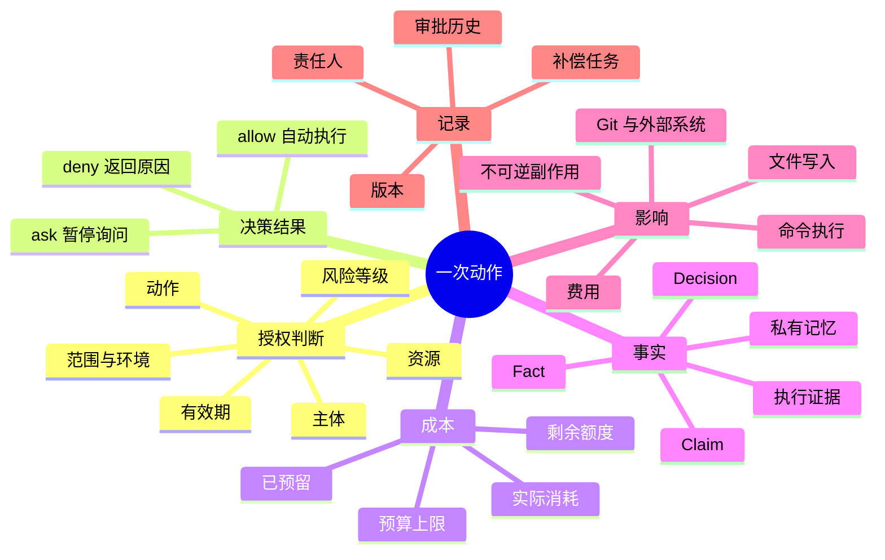
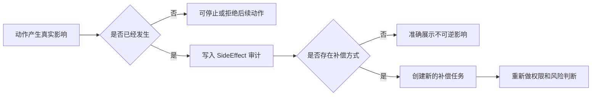
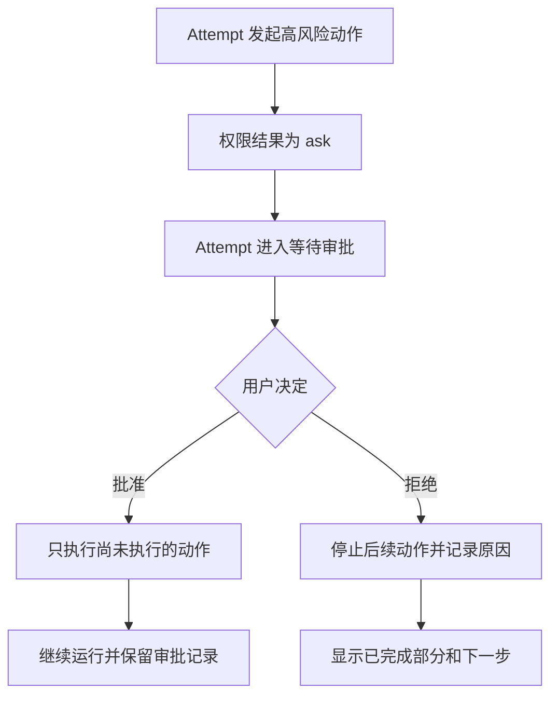
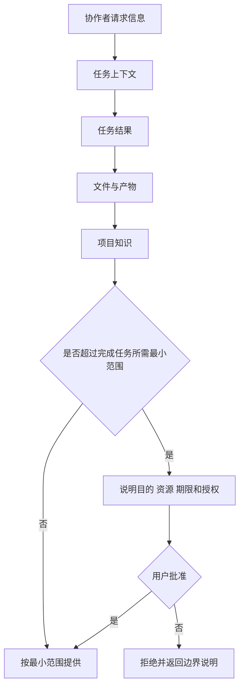
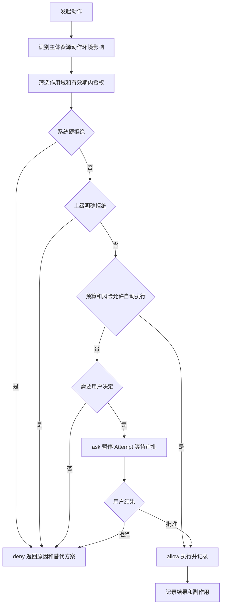
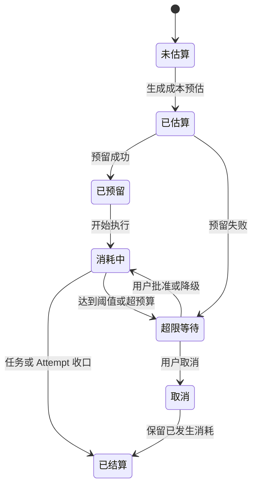
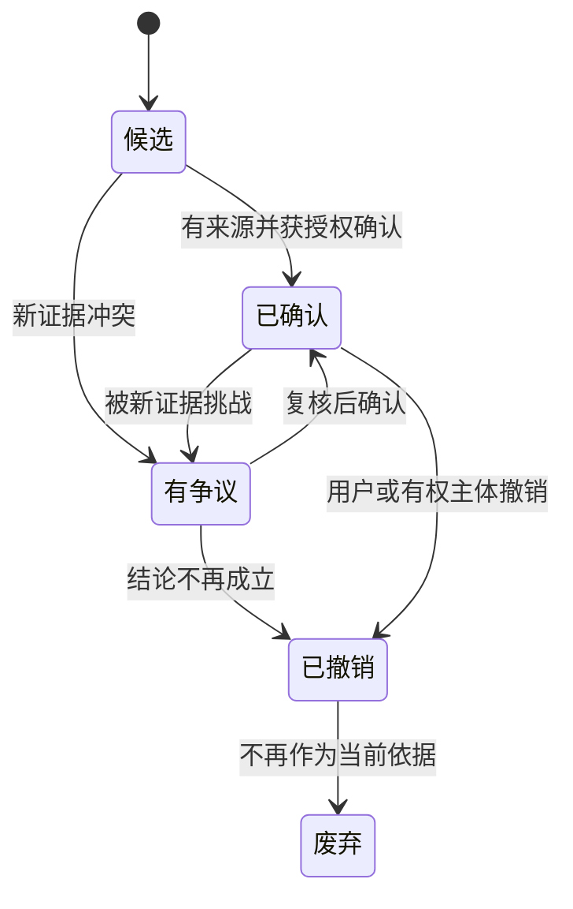

# PRD-05 权限、成本、事实与副作用

## 1. 这份 PRD 解决什么问题

用户必须知道 Agent 能做什么、需要自己批准什么、花了多少钱、已经发生了什么，以及哪些事情即使停止也不能自动撤回。前端要把这些信息讲清楚，后端要把每次授权、费用和影响留下记录。

## 1.1 权限治理全景

## 2. 权限不是角色名称

一个人是 PM、成员或 CEO，不代表他天然拥有全部权限。每次动作都根据以下 9 个字段判断：

| 字段 | 白话解释 |
|---|---|
| 主体 | 谁要做：用户、PM、成员或临时 Agent |
| 资源 | 对什么做：文件、仓库、外部系统或工程事实 |
| 动作 | 要做什么：读、写、删除、发布、部署、付费等 |
| 范围 | 允许影响哪些文件、目录、分支、项目或数据 |
| 环境 | 在本地、测试、预发布还是生产环境 |
| 有效期 | 这次、当前任务、当前会话还是一段时间 |
| 预算 | 最多花多少时间、Token、金钱或调用额度 |
| 风险等级 | 低风险、需确认、高风险或系统禁止 |
| 来源 | 用户明确批准、继承授权、PM 授权或系统默认 |

后端必须按字段保存并审计，不能只保存“某 Agent 有权限”。

## 3. 用户看到的三档入口

用户可以选择：

1. **请求批准**：每个需要授权的动作先停下询问。
2. **当前范围内自动处理**：在当前工程、资源、预算和有效期内自动执行，超出范围重新询问。
3. **完全访问当前工程**：允许工程范围内常规动作自动执行，但仍受系统禁止项、高风险规则、预算上限和环境限制约束。

三档只是简化入口，不替代内部 allow / ask / deny，也不能越过上级拒绝或系统硬拒绝。

## 4. 授权继承与向下派发

上级 Agent 派发任务时，只能传递自己被允许转授权的最小范围。派发必须限制资源、动作、期限、预算和递归深度；不能把原始凭据、全部私有记忆或整个工程权限直接传给下级。

权限变化只影响后续调用。撤销或过期不会把已经发生的运行、写入、费用和外部副作用改写掉；系统必须在历史记录中显示“授权何时生效、何时撤销、期间发生了什么”。

## 5. 成本治理

每个任务和工程至少记录四个数字：预算上限、已预留、实际消耗、剩余额度。成本要能归属到任务、TaskAttempt、Agent、工程和外部服务。

开始派发前可以预留预算；执行中达到阈值时暂停、降级或询问；重试和取消产生的实际消耗照实计入。预算不足不能被包装成普通失败，也不能静默继续。

## 6. 事实、决定、证据和记忆

| 类型 | 用户能理解的含义 | 是否等同于文件 |
|---|---|---|
| 事实（Fact） | 项目当前认可的一条信息 | 否，必须有来源和版本 |
| 决定（Decision） | 用户或有权主体作出的选择 | 否，必须有决定人和时间 |
| 主张（Claim） | 尚未完全确认的说法 | 否，需要验证或标记争议 |
| 执行证据 | 运行、测试、日志或外部返回结果 | 否，只证明发生过什么 |
| 私有记忆 | 某 Agent 自己的上下文和经验 | 默认不共享 |

事实状态为“候选 → 已确认 / 有争议 → 已撤销或废弃”。事实变更必须保留旧版本，并通知依赖该事实的任务重新评估；不能静默改写历史。

## 7. 外部副作用分级

| 动作 | 默认处理 |
|---|---|
| 读取文件、运行低风险测试 | 当前范围内可自动 |
| 写入工作区文件、创建分支 | 记录变更；按用户授权执行 |
| Git 合并、远程推送、共享资源修改 | 需要明确范围和责任人 |
| 发布、部署、生产写入、删除、付费 | 必须逐次确认或首版禁止 |
| 系统级危险动作 | 永久拒绝，不得通过产品入口绕过 |

停止运行只阻止后续动作；已经写入的文件、已经执行的命令、已经产生的费用和外部变化不能假装回滚。若系统有补偿操作，必须作为新的、可审批的任务执行。

## 8. 运行中审批

审批等待时，TaskAttempt 进入“等待审批”，任务责任人保持不变。批准后从未执行的动作继续，已执行动作不重复；拒绝后明确显示拒绝原因、已完成部分和下一步选项。

## 9. 信息访问

协作按四层提供信息：任务上下文、任务结果、文件与产物、项目知识。默认只提供完成当前任务所需的最小上下文；超范围请求必须说明请求者、目的、资源、期限和用户批准。

## 10. 前端和后端验收

- 前端在任务卡、审批框和交付页显示责任人、授权范围、预算四数、等待原因和已发生副作用。
- 后端能审计主体、资源、动作、授权来源、预算、审批、结果和副作用。
- 撤销授权后，旧运行和历史费用仍可查询。
- 争议事实不会直接覆盖已确认事实，依赖任务收到影响通知。
- 跨工程访问首版默认拒绝，并给出可理解的原因。

## 11. 授权判断流程

用户或 Agent 发起动作时，系统按以下顺序处理：

1. 识别主体、资源、动作、环境和预计影响。
2. 查找当前任务、会话、工程和账户层授权，按作用域和有效期筛选。
3. 先应用系统硬拒绝，再应用上级 `deny`，再检查预算和风险。
4. 得到 `allow`、`ask` 或 `deny`：允许则执行，询问则暂停 Attempt，拒绝则返回原因和替代方案。
5. 将授权判定、实际动作、结果和副作用写入审计记录。

前端显示“为什么需要这个权限、影响哪些资源、会花费多少、授权多久、拒绝后怎么办”；后端不能只根据按钮名称或角色名称放行。

## 12. 预算状态机

预算上限由用户或工程策略给出，预留发生在派发或高成本动作前，实际消耗来自底层计量，剩余为上限减去预留和实际消耗。预留失败时不能静默派发；实际消耗超过预估时，系统暂停后续高成本动作并请求决定。

## 13. 事实和记忆的访问规则

任务需要什么就提供什么：目标和约束、必要文件/产物、相关结构化结果、已确认项目事实。默认不提供兄弟任务 transcript、完整会话、私有 memory、NoteWall、凭据和跨工程内容。Agent 请求超范围信息时，必须说明目的、资源、期限、影响和授权来源；批准后也只授予最小范围。

Fact 被撤销或产生争议时，系统保留原版本，将新状态和影响任务列出来；不能因为某个新摘要或文件版本出现就自动覆盖旧事实。

## 14. 外部副作用处理模板

每次副作用记录：动作主体、目标资源、动作类型、开始/结束时间、授权来源、范围、环境、预算、结果、产生的变化、是否可逆、补偿方式、关联 TaskAttempt 和责任人。补偿动作作为新任务处理，必须重新进行权限和风险判断。

## 15. 前端页面契约

会话是 Agent 展示执行过程的第一工作现场。权限、成本、事实和副作用信息应在相关动作发生时进入会话上下文，并可通过当前对象检查视图展开查看；不要求把所有治理对象长期堆在一个万能 Tab 中。工程总览、团队信息和审计详情按需打开，具体位置由前端设计决定。

| 页面/卡片 | 必须显示 |
|---|---|
| 权限请求卡 | 动作、资源、范围、环境、风险、预算、有效期、批准/拒绝 |
| 成本卡 | 上限、已预留、实际消耗、剩余、归属和超限原因 |
| 事实卡 | 内容、来源、版本、确认者、状态、争议、影响任务 |
| 副作用卡 | 已发生动作、资源变化、是否可逆、补偿入口 |
| 访问拒绝卡 | 拒绝规则、缺少的授权、可申请的最小范围 |

底层工具日志、原始 transcript 和事件流可以折叠，但不能用折叠隐藏失败、拒绝、同步缺口、预算超限或不可逆影响。

## 16. 首版验收矩阵

| 给定条件 | 用户动作/系统事件 | 期望结果 |
|---|---|---|
| 工程内低风险读文件 | Agent 发起读取 | 自动允许，记录资源和结果 |
| 需要写入当前工程文件 | Agent 发起写入 | 按三档授权处理，显示范围并记录 ChangeSet |
| 预算接近上限 | 新 Attempt 需高成本调用 | 暂停或询问，不静默超支 |
| 用户撤销权限 | 旧 Attempt 已写文件 | 后续调用被拒绝，旧写入和费用仍可查 |
| 成员请求跨工程文件 | 无借调授权 | 默认拒绝并解释边界 |
| 事实被新证据推翻 | 用户提交争议 | 旧版本保留，相关任务收到影响通知 |
| 用户停止运行 | 命令已经执行 | 停止后续动作，已发生副作用准确展示 |

## 17. 结论等级

【已确认产品规则】权限与模式分离、三档入口、上级硬边界、权限衰减、预算四数、撤销不回滚历史、副作用可审计。

【首版建议】单用户单工程、当前工程内资源、低风险自动和高风险逐次确认。

【待用户裁定】多用户共享授权、跨工程借调、自动补偿和长期预算策略。

【待技术核查】DSH 工具审批拦截、成本计量、凭据隔离、工作树边界、外部资源审计和事件最终一致性。
