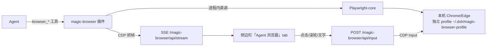

# 08 自研浏览器插件（magic-browser）

> 大白话设计文档。产品语义见 [PRD-02 §18](../01-产品/PRD-02-代理与CEO工作方式.md)；
> 本文件回答"怎么实现的、为什么这么实现"。

## 一句话说清

一只真 Chromium，两个操作者：Agent 用 10 个 `browser_*` 结构化工具干活（Playwright-core 引擎），人在 DSH 侧边栏的「Agent 浏览器」tab 看实时直播，随时用鼠标接管。**驱动层用最成熟的引擎（微软 Playwright），产品层（直播/接管/集成）是 Magic 自己的。**

## 结构

## 关键决定与理由

| 决定 | 理由 |
|---|---|
| Playwright-core 而非裸 CDP / MCP 中转 | 微软维护的引擎层（快照、等待、选择器），MCP 是给无插件宿主的中转，DSH 插件可以进程内直调，少一跳 |
| launchPersistentContext + 独立 profile | 登录态跨重启保留（M2 的 `ego_auth_flush` 等价物免费拿到），且与你日常浏览器隔离 |
| 本机 Chrome（channel chrome→msedge 兜底） | 不下载 130MB 的 Playwright Chromium；用户装啥用啥 |
| 快照范式（ariaSnapshot + ref/selector/role 定位） | Agent 读文本树操作，比"截图猜坐标"省 token、点得准——Playwright MCP 的精华内化 |
| 工具返回**绝对路径** | 产物卡与媒体路由要求绝对路径（ego 相对路径坏图的教训） |
| 工具全部 `isConcurrencySafe: false` | 浏览器是单资源，串行免锁 |
| 观察窗走 better-sidebar 注册 | 服务已在（我们 vendor 了 better-sidebar），client 侧 `ctx.get('betterSidebar')` 机会性注册，缺省静默降级 |
| 有头默认 + `MAGIC_BROWSER_HEADLESS=1` 可切 | 有头全帧率直播；无窗低帧率（~1fps，上游实测数据），两种形态用户自选 |

## M1 工具面（10 个）

`browser_navigate` / `browser_snapshot` / `browser_click(ref|selector|role+name)` / `browser_type` / `browser_select` / `browser_scroll` / `browser_screenshot` / `browser_tabs` / `browser_console` / `browser_close`

不做「对外提交」类工具（PRD-02 §18 边界：不可逆外部副作用永远等人审批）。

## 已知边界（M1）

- 直播跟随 Agent 当前 tab；人类在浏览器里新开的标签页也会进跟踪集合。
- 观察窗文字输入是"整段插入 + Enter/Esc 按钮"，不是逐键回放。
- LAN 访问不在 M1 信任围栏内（仅 loopback Host）。
- ego-browser 仍挂载为兜底/对比；M3 决定退役时机（用户在 better-sidebar 设置里可先关掉它的 tab 防混淆）。

## 演进

- M2：下载捕获落工作区、验证码/登录提醒条、tab 历史抽屉、声明式设置页。
- M3：headless 帧率优化（GPU flags 实验）、快照缓存、退役 ego。
- 桌面端：合并成「一个浏览器、两个操作者」的原生形态（PRD 既定方向）。
