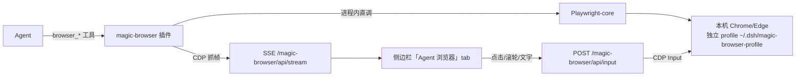

# 08 自研浏览器插件（magic-browser）

> 大白话设计文档。产品语义见 [PRD-02 §18](../01-产品/PRD-02-代理与CEO工作方式.md)；
> 本文件回答"怎么实现的、为什么这么实现"。

> **状态（2026-09-13）：已退役。** M1 实测跑通后，用户裁定「无头 + 直播画布」
> 形态不满足产品要求——能看不能用：观察窗是看 agent 操作的"画面"，不是
> 人可以直接操作的真浏览器（输入是整段插入，不是原生逐键交互）。浏览器
> 基线改定 **dsh-builtin-browser**（共享真实浏览器，vendor 于
> `plugins/dsh-builtin-browser/`，挂载见 `patches/web.patch.yml`）。本文
> 保留为复盘与教训，退役原因详见文末「退役复盘」。

## 一句话说清

一只真 Chromium，两个操作者：Agent 用 10 个 `browser_*` 结构化工具干活（Playwright-core 引擎），人在 DSH 侧边栏的「Agent 浏览器」tab 看实时直播，随时用鼠标接管。**驱动层用最成熟的引擎（微软 Playwright），产品层（直播/接管/集成）是 Magic 自己的。**

## 结构

## 关键决定与理由

| 决定 | 理由 |
|---|---|
| Playwright-core 而非裸 CDP / MCP 中转 | 微软维护的引擎层（快照、等待、选择器），MCP 是给无插件宿主的中转，DSH 插件可以进程内直调，少一跳 |
| launchPersistentContext + 独立 profile | 登录态跨重启保留（M2 的 `ego_auth_flush` 等价物免费拿到），且与你日常浏览器隔离 |
| 本机 Chrome（channel chrome→msedge 兜底） | 不下载 130MB 的 Playwright Chromium；用户装啥用啥 |
| 快照范式（ariaSnapshot + ref/selector/role 定位） | Agent 读文本树操作，比"截图猜坐标"省 token、点得准——Playwright MCP 的精华内化 |
| 工具返回**绝对路径** | 产物卡与媒体路由要求绝对路径（ego 相对路径坏图的教训） |
| 工具全部 `isConcurrencySafe: false` | 浏览器是单资源，串行免锁 |
| 观察窗走 better-sidebar 注册 | 服务已在（我们 vendor 了 better-sidebar），client 侧 `ctx.get('betterSidebar')` 机会性注册，缺省静默降级 |
| 有头默认 + `MAGIC_BROWSER_HEADLESS=1` 可切 | 有头全帧率直播；无窗低帧率（~1fps，上游实测数据），两种形态用户自选 |

## M1 工具面（10 个）

`browser_navigate` / `browser_snapshot` / `browser_click(ref|selector|role+name)` / `browser_type` / `browser_select` / `browser_scroll` / `browser_screenshot` / `browser_tabs` / `browser_console` / `browser_close`

不做「对外提交」类工具（PRD-02 §18 边界：不可逆外部副作用永远等人审批）。

## 已知边界（M1）

- 直播跟随 Agent 当前 tab；人类在浏览器里新开的标签页也会进跟踪集合。
- 观察窗文字输入是"整段插入 + Enter/Esc 按钮"，不是逐键回放。
- LAN 访问不在 M1 信任围栏内（仅 loopback Host）。
- ego-browser 仍挂载为兜底/对比；M3 决定退役时机（用户在 better-sidebar 设置里可先关掉它的 tab 防混淆）。

## 演进

- M2：下载捕获落工作区、验证码/登录提醒条、tab 历史抽屉、声明式设置页。
- M3：headless 帧率优化（GPU flags 实验）、快照缓存、退役 ego。
- 桌面端：合并成「一个浏览器、两个操作者」的原生形态（PRD 既定方向）。

## 退役复盘（2026-09-13）

### 走到哪一步

M1 完成并经用户实测：Playwright-core 驱动本机 Chrome/Edge（独立
profile，登录态跨重启），10 个 `browser_*` 工具（navigate/snapshot/click/
type/select/scroll/screenshot/tabs/console/close，全部带
`output{schema,render}`），CDP 抓帧 + SSE 直播到 better-sidebar 的
「Agent 浏览器」tab，截图落 `D:\BoatHarness\magic-browser\`，产物卡
绝对路径可预览。

### 为什么退役（对照 PRD-02 §18 的产品要求）

| 产品要求 | 直播画布形态的实际体验 | 结论 |
| --- | --- | --- |
| 人随时亲手接管 | 观察窗里点击走的是 CDP Input 合成事件转发，输入是"整段插入 + Enter 按钮"，不是原生逐键交互 | 不好用 |
| 看得见 = 可用 | 无头 Chromium + 视频流：用户看的是"画面"，页面本体在无头进程里，焦点/滚动/弹窗都是二手体验 | 能看不能用 |
| 无头默认 | 无窗低帧率（~1fps）直播进一步削弱"看着像真浏览器"的感受 | 方向性错误 |

一句话：**直播是给"旁观"用的，而产品要的是"共用"**。用户裁定形态不合格，
基线改定 dsh-builtin-browser（`docs/why-browser.md` 的「共享真实浏览器」
路线：真窗口、真页面、CDP 同页驱动、人直接上手）。

### 教训（对后续仍然有效）

1. **形态先行**：浏览器能力的核心是"人和 agent 操作同一个真实页面"，
   任何"转播"方案（视频流、截图轮询）都到不了这个标准——先问形态对不对，
   再谈引擎和工具面。
2. **保留下来的正确决定**（dsh-builtin-browser 同样受益）：
   工具必须带 `output{schema,render}`；快照范式（结构化定位）优于截图猜
   坐标；工具返回绝对路径（产物卡/媒体路由要求）；浏览器是单资源，工具
   全部串行（`isConcurrencySafe: false`）；登录态独立 profile 落盘。
3. **两套浏览器工具不能并存**：ego 退场的教训在 magic-browser 上再次
   成立——同 profile 内多个 browser_* 工具集会让模型随机选择，退役必须
   连挂载一起做。

### 复活条件

源码保留在 `plugins/magic-browser/`（未删）。只有当出现"必须无头批量
抓取/服务器端取证"这类与「共享窗口」正交的需求时，才值得把它以独立
工具集（改名 browserx_* 之类）重新挂载，且不得与共享浏览器同时暴露。
