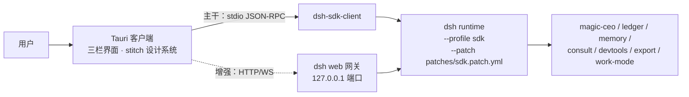

# 09 自有客户端架构

> 产品形态裁定见 [PRD-01 §2.1](../01-产品/PRD-01-Magic产品总览.md)：Magic 以自有 Tauri 桌面客户端交付，DSH 是后台执行底座。本文回答：客户端怎么连 runtime、哪些已验证、缺什么、怎么分期。不能重新定义产品语义。

## 1. 目标（一句话）

用自己的 Codex 风格界面驱动完整的 DSH runtime + Magic 插件，**不重写执行底座，不 fork DSH**。

## 2. 架构（双通道）

| 通道 | 用途 | 承载 |
|---|---|---|
| **SDK（主干）** | 发消息、收全量 session 事件流（对话、工具调用、CEO 派活、成员状态）、子代理谱系、模型路由与 maxTokens | `dsh-sdk-client` spawn 的 runtime 子进程，stdio JSON-RPC |
| **Remote（增强）** | 审批卡应答（`approval/request` + POST `/api/$events/result`）、文件树 / diff / 变更流（`remote.workspaceFiles`）、会话列表 | 客户端 HTTP+WS 连 `dsh web` 同一 runtime 的网关，cookie 认证 |

两者**驱动同一个 runtime**：日常运行时以 SDK 进程为主，Remote 网关用 `dsh web` 连接同一 `$DSH_HOME` 下同一 workspace 的会话（会话共享由 DSH session 持久化保证；**同会话双写并发的收口方式待技术核查**）。

## 3. 已验证事实（2026-09-16 实测/实读，证据为证）

| # | 结论 | 证据 |
|---|---|---|
| 1 | SDK 握手通过：外部进程可 spawn runtime（sdk profile + Magic 产品插件全载）并完成 `initialize` | `tools/sdk-smoke/smoke.mjs` 实跑输出 `handshake: ok`；插件日志 7 个 `plugin loaded` |
| 2 | CEO 事件全量进 `session.event` 流 | `plugins/magic-ceo/src/journal.ts:86-96`（`appendIgnorable` → `session.append`）→ `packages/core/session/src/index.ts:747-752`（append 即派发 `session/event`）→ `packages/sdk/server/src/server.ts:95-98`（全量转发给客户端） |
| 3 | SDK 协议面：3 请求 + 4 通知；**无取消、无审批应答、无文件访问** | `packages/sdk/protocol/src/types.ts:107-119`；`packages/sdk/protocol/README.md` Known Limitations（"Server→client requests are a dead capability … future approval flows"） |
| 4 | Remote 网关对非浏览器客户端开放：loopback Host 过 fence、token 换 cookie | `packages/client/connection/src/api-request-trust.ts:10-11`（注释明示 "Non-browser and remote clients pass the same fence"）；`browser-auth.ts:52-58, 240-282` |
| 5 | 审批闭环通道：WS `$events` waterfall 帧下行 + HTTP POST `/api/$events/result` 应答 | `packages/api/gateway/src/stream-protocol.ts:6-12, 51-57, 87-137`；`packages/api/remotes/src/remote-events.ts:16-36` |
| 6 | Remote wire 协议是静态手写校验，不要求客户端携带 Typert 生成物 | `packages/client/connection/src/rpc-schema.ts:35-40`；`packages/api/gateway/src/index.ts:936-951` |
| 7 | Remote 协议**无版本化承诺**——跟随 DSH 升级是长期成本 | `packages/client/connection/README.md`（无稳定性声明） |

## 4. 客户端技术栈（2026-09-16 裁定）

- **壳：Tauri 2**（用户裁定：多 agent 高并发场景，Rust 侧资源占用与并发模型更优）。`old-design` 分支的 Tauri 历史实现只作追溯，不构成约束，也不作为复用来源。
- **前端：React + TypeScript**，设计 tokens 直接从 `stitch_codex_ui_clone/*/DESIGN.md` frontmatter 生成 CSS 变量（颜色 / 字体 / 圆角 / 间距全套已定义）；`code.html` 是视觉参照，不直接作为代码引入。
- **SDK 客户端**：`@deepseek-ai/dsh-sdk-client` 在 Tauri 的 Node sidecar（或 Rust 侧 spawn 的 node 子进程）中运行；协议层很薄，必要时可按 `dsh-sdk-protocol` 的静态形状在 Rust 侧复刻（stdio 行帧 JSON-RPC）。
- **复用代码**：`plugins/magic-ceo-ui/src/team.ts`、`flow.ts`、`process-summary.ts` 是无 React 依赖的纯函数（事件折叠 / 画布布局），直接搬进客户端复用。

## 5. 界面区块映射（stitch 设计稿 → 数据通道）

| 设计稿区块 | 数据来源 | 状态 |
|---|---|---|
| 左栏会话树 / 项目 | Remote 会话列表（`api-session/*` 事件） | Remote 线 |
| 中栏对话流（计划卡 / 验证卡 / diff 卡） | SDK `session.event` | ✅ 已验证 |
| 中栏「执行计划 第N步/共M步」 | 代理=todo 事件；CEO=`ceo_plan` + `ceo/run-journal` | ✅ 已验证 |
| 中栏底部工作方式切换器 | `magic-work-mode`（客户端本地状态 + 提示词注入约定） | 接线 |
| 模型选择器 + token 计数 | SDK `initialize` 路由 + `token-meter` 事件 | 接线 |
| 右栏审查（diff） | Remote `workspaceFiles` changes 流 | Remote 线 |
| 右栏终端 | **缺口**：Remote 无终端通道；better-sidebar 的终端是私拉 pty | 缺口② |
| 右栏浏览器 | `dsh-builtin-browser`；Tauri 侧接 `electronViewHost` 等价缝或维持自托管窗口 | 缺口③（形态待定） |
| 审批卡 | Remote `approval/request` + `$events/result` | ✅ 证据完整 |
| CEO 团队画布 | SDK 事件流 + 复用 team.ts/flow.ts | ✅ 已验证 |

## 6. 缺口清单与补法

| 缺口 | 影响 | 补法（按优先序） |
|---|---|---|
| ① 会话列表（SDK 无 `session/list`） | 左栏会话树 | Remote 线获取；或客户端本地索引 session 目录（`$DSH_HOME/sessions`） |
| ② 终端面板 | 右栏终端 tab | 自建小型 Magic 插件经 ctx 缝暴露 pty（参照 better-sidebar 的 ptyManager）；或 M3 砍掉改用 shell 工具调用 |
| ③ 浏览器内嵌 | 右栏浏览器 tab | M3 决策：Tauri webview 内嵌 CDP 页面成本高时，维持 dsh-builtin-browser 自托管窗口（现状语义可用） |
| ④ 同会话 SDK+Remote 双通道并发写 | 状态一致性 | 待技术核查：确定"会话归属通道"规则（例如 Remote 只读 + 审批应答） |
| ⑤ runtime 生命周期管理 | 客户端开关时 runtime 跟随启停 | Tauri sidecar 托管 node 子进程；崩溃重启策略 |

## 7. 界面保真纪律（2026-09-16 用户裁定，防设计跑偏）

用户已完成高完成度的界面设计（`stitch_codex_ui_clone/`），客户端开发必须遵循以下硬规则：

1. **Tokens 机械提取**：颜色 / 字体 / 圆角 / 间距一律从该屏 `code.html` 的 Tailwind `theme.extend` 脚本化生成，禁止手工挑选近似值。**视觉权威是 `code.html` + `screen.png`**；`DESIGN.md` 正文（如 48px 收起、额外色值）不作为约束（2026-09-16 用户裁定）。frontmatter 色板与 HTML theme 一致时仅作对照，冲突以 HTML 为准。
2. **无出处不写组件**：界面上每个元素必须能在 `code.html` / `screen.png` 中指出出处。开发过程中想加设计稿里没有的东西，默认不加，先问用户。
3. **不做静默"改进"**：不得凭通用经验修改用户的设计选择（间距、圆角、配色、文案、布局）；对比发现差异时要么修正回设计稿，要么列出来问用户。
4. **像素对照**：每完成一个区块，用 `screen.png` 与实际渲染并排比对后再进入下一块。
5. **不确定不自造**：设计稿中存在但 Magic 尚无对应功能的入口（如「自动化工作流」「工作树」「技能扩展」），**画出入场但置灰 / 空态**，不虚构数据假装可用；该入口对应的功能是否做、先做什么，逐项问用户裁定。
6. **图标 / 特效 / 动画必须先问**（2026-09-16 用户补充裁定）：这三类内容最容易自作主张，一律停下来问用户确认后再做；设计稿里有明确出处的（如 Material Symbols 图标名）也要列清单确认。
7. **验收以设计稿为准**：M1 验收标准 = 与设计稿肉眼一致 + 数据真实（不是"开发者觉得好看"）。
8. **信息架构以用户裁定为准**（2026-09-16）：左栏导航去掉「工作树」「历史与审计」，「自动化工作流」改为「定时任务」（图标由用户提供，暂以 Material Symbols `timer` 占位）；置顶任务/项目/任务分组支持折叠收纳；左栏固定，仅列表内容超高时内部滚动。视觉基线仍是 `code.html`，区块内容与用户裁定冲突时以裁定为准。
9. **二轮风格裁定（2026-09-16，quiet 风格）**：用户提供的 Codex 侧栏组件（React txt）与新建任务 SVG 为左栏风格基准——新建任务/导航行不突出（无蓝底、无光晕、无 ⌘K 徽标，新建任务用 `edit_square` 图标）；仅 hover 有轻微背景（`surface-container-low`）、active 轻微缩放；去掉「项目」入口行（项目走会话树分组）；分组标题去大写、12.5px medium；行高 32px、圆角 8px、标签 14px medium、计数纯文本 tabular。stitch `code.html` 的高亮蓝按钮与光晕在左栏不再使用。
10. **三轮交互裁定（2026-09-16）**：所有行整行可点（会话行缩进改为行内边距）；置顶任务/项目/任务默认收起（收起带「›」箭头、展开无箭头）；项目标题悬浮显示 `···`/`+`（`+` 打开「创建项目」弹窗，弹窗含名称输入与源文件夹区，创建即入列表）；工作区行无展开箭头、点击折叠、悬浮显示「添加新会话」；会话行去掉 `chat_bubble` 图标与缩进竖线；工作区行的计数/待审核/ci 角标随 quiet 风格移除（待用户确认是否以别的方式回归）。
11. **四轮细节裁定（2026-09-16）**：任务行去掉前置图标；技能扩展去掉计数；**会话运行中动效**——运行中会话前置「书写笔」动画（用户提供的动效规范 `code.html` 方案一 Living Ink Pen：运笔微摆 + 笔尖发光 + 墨迹线，纯 CSS keyframes；**黑白配色、无「运行中」文字角标、无蓝色底**——笔在写即代表运行中，2026-09-16 二次确认），替代静态圆点；箭头位置修正为文字后（`分组名 ›`）。
12. **会话状态生命周期（2026-09-16，依据用户提供的会话状态流转规范 code.html）**：`running` 白笔运笔动效；`interrupted`（中断/异常停止）笔停下变红（静态 #ef4444，无运笔动画）；`completed` 绿色勾（「墨凝收笔与翡翠微绽」方案一：`bg-tertiary/20` 圆 + check，`emeraldBloom` 动画；**2026-09-17 裁定：改为 1.8s 无限循环，持续提醒用户已完成，点击会话行后提示消失**）；**点击完成/中断的会话行 → 前置提示整个去掉，变纯文本行**。不使用文字角标。
13. **项目文件夹 3D 开合动画（2026-09-17，迷你 3D 图标方案）**：项目行 folder 图标替换为 `Folder3DIcon`（用户提供的 FolderComponent txt 迷你版，18px，`motion/react` 驱动）：盖子 rotateX 关 -15°/悬浮 -40°/展开 -55°，弹簧物理 stiffness 120 / damping 14 同源，整体 -8° 倾斜（同日裁定：倾斜观感更好）；卡片飞出在行内尺寸下不可读，按用户确认省略。
14. **品牌独立与界面路线定案（2026-09-17）**：用户确认 Magic 是自有 agent 产品，DSH 仅作执行底座（"大脑"），产品界面与品牌不出现 DSH/DeepSeek；**否决**「Tauri 壳嵌入 DSH web 界面」与「把 Magic UI 做成 DSH web 客户端插件」两条捷径（技术核查：DSH web 无路由整页 SPA，无法按区块嵌入，组件与 cordis 运行时强耦合拆出≈重写）。底座升级按「评估选择性接入」处理：SDK 承诺面主干 + Remote 收敛适配层 + `tools/sdk-smoke` 回归。同日裁定：代码块/diff 展示采用用户提供的 `stitch_codex_ui_clone/UI/diff.txt` CodeBlock 设计（结构/交互照搬，组件 `src/components/CodeBlock.tsx`）；配色二次裁定为**跟随界面暗色自适应**（全部颜色走 CSS 变量表，`.cb-theme-light` 浅色表保留供将来亮色界面，组件零改动）；文件类型图标（DSH 图元包 `dsh-client-ui-primitives` 全彩 SVG，证据 `plugins/dsh-better-sidebar/node_modules/.../lib/index.js:3191-3195,3374-3382`）待 SDK/Remote 接线时统一接入。
15. **对话区采用 codex-ui（2026-09-17，已被裁定 16 降级为备用）**：中栏对话流一度改用 `reference-project/codex-ui`（整库搬入 `apps/magic-desktop/src/vendor/codex-ui/`，165 处颜色 token 化为 `--cv-*` 变量）。用户对比 DSH 网页实际体验后裁定该实现「差距大、设计不合理」，本裁定降级为备用方案，代码保留不删。
16. **对话区换回 DSH ui-chat 内核（2026-09-17，现行方案）**：用户最终裁定对话区还原 DSH 网页体验。做法是「搬内核、画外壳」：`packages/client/ui-chat` + `ui-tool`（0.1.5-rc.2）的纯渲染组件（AssistantMarkdown / ReasoningRow / MessageItem 气泡 / 全套 NodeView / 工具卡）与 conversation-nodes 事件折叠层（match/update 纯函数），剥离 cordis 注册壳与 reactive store 依赖后搬入 `apps/magic-desktop/src/vendor/dsh-chat/`（类型收敛 vendor-types.ts，令牌桥 tokens.css，`.vendor-dsh-chat` 挂载作用域）；壳自写 `apps/magic-desktop/src/conversation/`（ChatFlow 消息流 + kind 分发 + Turn-process 折叠逻辑移植自 ChatNodeSeat、Composer quiet 输入条、chat-store 整窗折叠），mock 事件窗口静态渲染验证通过（指令卡 / 用户气泡 / 过程披露折叠工具卡 / 思考行 / 轮尾动作行 / 分支按钮）。SDK 接线时 `session.event → chat-store.appendEvent` 即可复用同一折叠层，不需要重写渲染。
17. **会话区对齐 Magic 组合 web 端（2026-09-17，本轮四项 + 先记录清单）**：用户启动组合插件后的 `dsh web`（patch 挂载全部 Magic 插件）实测比对后裁定「web 端有的会话区能力都要设计进自有客户端」。本轮落地四项：①轮过程折叠头换 `magic-ceo-ui/TurnProcessSummary`（用户已在 web 端验收的 codex 式「已处理 2m27s · 已探索 N 项」摘要行；其数据层 `turn-summary.ts` 走快照 `legacy.nodes + legacy.turnTimings`，与 vendor/dsh-chat 快照契约完全一致、零适配；ui-chat 原生「N 次工具调用」计数头与壳层 MagicTurnProcessHeader 均退役）②轮尾「用量 N tok」「用时 Ns」pill（挂 vendored TurnTailNodeView 预留的 `usageAction` 缝；数据取 turn-tail `tokenUsage` 与 turn start/end 时间）③输入框下方会话统计条（StatsPills 形态复刻：「N 轮 N 步 · N tok/s」「N tok · 缓存命中 N%」；M1 从 turn-tail 聚合，DSH 用 sessionStats projection，SDK 接线后换数据源；统计弹窗 M2 补）④运行中状态行换**毛笔画鼓楼动画**（用户指定 code.html「水墨重楼」，7 笔 rAF 序列勾画零改动；浅墨反色适配暗色界面；旁注「绘画中」；位置同 DSH TurnStatus——流末尾左对齐，提交后等待回包期间常驻，`chat-store.awaitingReply` 驱动）。**修复**：assistant 操作行重复（上轮挂的画廊复制/重试行与 DSH 原生轮尾 MessageIconActions 叠加；删画廊行，保留 DSH 原生 chrome 为验收基准）。**先记录清单**（web 端有、客户端暂缺，后续逐项裁定）：交付文件「本次产出」区（ui-deliverables）、消息反馈（好的/有问题的回答）、上下文注入 chips、CEO 委派图卡、会话头层级导航与对话/轨迹 tab、划选注释与侧边提问（sidenote）、统计弹窗（stat-dialog）。**同日追补**（用户裁定「4+5+6 一起做」）：①「本次产出」行（ui-deliverables ProducedFiles 形态，挂 renderTurnTailSlot 缝；M1 从本轮 edit/write 类 tool-call 的 argsRaw 提取目标路径，SDK 接线后换 deliverables 投影）②消息反馈对（MessageFeedbackActions 形态，挂 renderAssistantActions 缝；M1 本地状态 toggle，无 session store 与反馈弹窗）③上下文注入 chips（ContextInjectionRow 早已 vendored，mock 补 `source: { kind: 'plugin' }` 的 user/message 事件即渲染；web 端汉化文案一致）。剩余未对齐：CEO 委派图卡、会话头层级导航与对话/轨迹 tab、划选注释（sidenote）、统计弹窗、上下文用量指示、正文文件引用 chip（等 SDK 数据）。

18. **左栏会话管理（2026-09-17，对齐 Magic 组合 web 端 ui-workspace 包）**：用户裁定「对话区不改布局，会话管理功能参考 web 版做好」。web 端证据：左栏会话行 hover 出「⋯」操作菜单，三项 = 重命名（弹窗，`rename.session.title`）/ 分叉会话（`menu.fork`）/ 归档会话（`menu.archiveSession`）（`reference-project/deepseek-harness/packages/client/ui-workspace/src/client/locales.ts:38-47`；3099 实例 DOM 实测一致）。桌面端落地（`SessionSidebar.tsx` + `App.forkSession`）：置顶任务/项目会话/任务三分区的会话行统一加 hover「⋯」菜单；**重命名**=弹窗（输入框预填 + 取消/重命名），M1 为侧栏显示名覆盖（store/种子键不变，SDK 接线后换真 rename）；**分叉会话**=「显示名（分支）」新会话追加到同分区并切换，App 复制 mock 种子窗口（SDK 接线后换 `session.fork`）；**归档会话**=从列表隐藏，归档当前会话则切空白对话（SDK 接线后换真归档）。任务区静态行同时改为可点切换会话（对齐 v2 联动语义）。布局零改动（菜单/弹窗均为 hover 或浮层）。

19. **左栏会话整理（2026-09-17，用户四图）**：①任务行不再展示时间（mock-data tasks 去 time 字段）②行 hover 操作 = **置顶 pin 在 ⋯ 菜单前面**（tooltip 置顶聊天；Icon 组件加 `filled` 属性走 Material Symbols FILL 变轴）——点击置顶移入「置顶任务」模块；置顶行 pin **实心常显**（图三，tooltip 取消置顶聊天），点击回 origin 记忆的原位（pin 时记录 来源分区/工作区+下标，项目工作区内置顶的会话取消后自动回原工作区）③会话行可拖拽（HTML5 DnD，`dropHint` 上下缘 2px 主色插入指示线 + 目标区 ring 高亮）：拖到「置顶任务」头/空区=置顶、拖到工作区行/空区=移入该工作区（无工作区的任务可拖进任意工作区）、行间拖动=排序（beforeKey 语义插入，置顶区内排序不覆盖 origin）；空分区显示虚线落点占位④「新建任务」下新增**搜索任务**入口 → 新组件 `SearchPalette.tsx`（图四命令面板）：全部会话平铺（右侧分组名 + Ctrl+N 徽标）、输入即时过滤、↑↓/Enter/点选跳转对话区；快捷操作组（新聊天/导出当前会话可用，打开文件夹 Ctrl+O/搜索文件 Ctrl+P 置灰待桌面壳）、设置组（常规/导入/外观/语音）按裁定 5 置灰占位。**导出会话**（`conversation/session-export.ts` + App.exportSession）：快照序列化 Markdown（用户/思考引用块/正文/工具行/命令行）Blob 下载；Ctrl+N/Ctrl+数字在浏览器预览可被浏览器保留键抢占，Electron 壳阶段注册全局加速器；SDK 接线后置顶/拖拽/导出换真实 session API。**同日修正**：mock 置顶任务拖出后标题丢失（任务/工作区插入值改用 base——侧栏键≠会话标题）+ 置顶区内后半插入 beforeKey 按 key 匹配；浏览器自动化四种拖拽方向全通过，用户侧「拖不动」疑似长跑 dev server 的 HMR 陈旧，需硬刷新核实。**右坞暂时隐藏**（同日用户裁定）：App 不再渲染 InspectorPanel，组件与审查面板代码保留待回归。**同日追加**：空的工作区不显示「拖动会话到此工作区」占位，新建工作区/项目时默认自动创建一个「新任务」会话并打开（工作区行本体仍是拖拽落点）。

20. **SDK 接线第一纵切（2026-09-17，浏览器 dev 形态直连 dsh web）**：技术核查结论——`dsh-sdk-client` 是 spawn `dsh --profile sdk` 子进程的 stdio JSON-RPC 桥（protocol 仅 initialize/prompt/session.event，无 list/fork/rename/archive），纯浏览器 Vite 应用无法直用，且右坞 better-sidebar 宿主路由只在 web profile 存在（sdk.patch.yml 明确不挂 webServer 类插件）→ 本轮形态：**magic-desktop 直连本机 `dsh web` 实例**（Magic 插件全挂），Vite 代理 `/api`+`/sidebar`+`/dsh-auth-connect` 同源化（`VITE_DSH_WEB_ORIGIN` 可改目标，默认 3099）。实现（`src/adapters/dsh-web/`：rpc.ts / mux.ts / web-backend.ts + App `?backend=web` 开关）：①认证：根路径 `GET /?token=` 一次性换 HttpOnly Cookie（browser-auth.ts:239-265），代理转发 Set-Cookie；**dsh web 有 Origin 信任围栏**（api-request-trust.ts:111-117，先于认证，失配 403）——代理须同时改写 Host（changeOrigin）与 Origin/proxyReqWs 头②RPC 信封 `{type:'client-request',rpcId,method,payload:{args}}`，args 按 Remote 描述符**形参名**键控（list→`{_request:{}}`、create/prompt/rename/fork→`{request:{...}}`，session-controller/src/index.ts）③事件流：WS `/api/remote.mux`（open 帧 payload={args:{request:{address,assistantStream}}}），item= snapshot（records 内 `{type:'event',event}` 整窗 seedWindow）/ 增量 `{type:'event',event}`（appendEvent；turn/end|turn-error 收口鼓楼等待态）/ assistant-stream（暂不渲染）；**事件即 SessionEvent，vendor 折叠层零适配**④会话域：list（按 cwd basename 归组进「项目」分区，标题取 projections.values.title，子代理会话暂不入列）、create（新建任务）、prompt（queue 模式）、fork、rename 已接；侧栏重命名/分叉/新建走真实命令，mock 分区（置顶任务/任务）web 模式隐藏⑤发送链路实测全通：prompt → 用户气泡实时出现 → 鼓楼等待 → 回复+用量 pill 无需刷新。**遗留**：rename 调用成功但标题未生效（疑似与 runtime 自动起标题竞争，待查）；拖拽/置顶对真实会话行仍是本地视觉组织（未接 workspace attachment）；归档 web API 未找到；流式瞬态帧（assistant-stream）未渲染；断线重连后靠 mux 重放 open 重快照。Electron 壳阶段同一 adapter 面换成 SDK 进程内桥。右坞 better-sidebar 接线（/sidebar 代理已就绪）为下一纵切。

21. **左栏默认态对齐设计稿 + 列表限 5 + 空白初始态（2026-09-17，用户反馈）**：用户指出「左坞默认样式跟之前设计的不一样；项目和最近（任务）都要有；新建任务应自动进入任务区；任务列表不该全展示，限 5 个剩下收起、展开后滑动找会话；关闭界面/应用再进来默认应关闭上次会话界面与内容」。落地：①**默认展开态**：设计稿 code.html 三区皆展开 → 现调整为「置顶任务默认收起（用户认可）、项目与任务默认展开」（此前三区全收起是偏差根源）②**任务区语义**：web 模式 = 全部真实会话按最近时间倒序（"最近"；新建任务经 session/create 后自动排第一）；mock 模式 = 本地任务列表，新建任务自动入列并打开（此前 mock 新建只开空白对话不入列表）；任务区与项目区分工 = Recents + Projects 并存（同一会话可两处出现，有意）③**列表限 5**（LIST_LIMIT）：任务区与每个工作区分组超过 5 条时显示「展开全部 N 条」（expand_more），展开后容器 `max-h-64 overflow-y-auto` 滚动查找，可「收起」恢复；实测真实数据 31 条/28 条分组正常 ④**空白初始态**：进入应用不自动恢复上次会话（activeId 初始空；此前 web 模式会自动打开最近会话、mock 模式默认打开第一个）；web 模式空白态直接发消息 = 先 session/create 再 prompt（follow snapshot 补齐事件）⑤置顶区两种模式都保留（web 初始为空，pin 真实会话后进入；默认收起）。实测：mock/web 双模式默认态、新建任务高亮入列、空白初始、限 5 展开收起全通过。**同日二次反馈修正**：①左栏顶部导航（新建任务/搜索任务/定时任务/技能扩展）移出滚动容器固定（`shrink-0` 块），不随会话列表滚动②「展开全部/收起」按钮从滚动容器内移出到 Section `footer`/容器外（列表滚动时按钮 Δ=0 固定），并美化为中心轻胶囊（11.5px、细箭头 keyboard_arrow、仅 hover 背景）③展开态滚动容器加底部渐隐 mask（提示还有内容）。

22. **左栏滚动改版 + 技能扩展页 + 设置整页（2026-09-17，用户反馈与设计稿）**：①**去掉「展开全部」**（用户反馈"很难用很丑"）：列表超可视行数（LIST_LIMIT=5）时直接区域内滚动（`max-h-40 overflow-y-auto` + 底部渐隐 mask），按钮与 footer/expandedLists 状态全部删除②**技能扩展页**（`src/skills/SkillsHub.tsx`，参考 `stitch_codex_ui_clone/codex_04_skills_hub_skill.md/code.html` + 用户图三插件市场，图三优先、密集两列行）：左栏不变、主区替换；数据源 = Remote `skills/list`（`{request:{sessionId}}` → SkillEntry[]，session-controller/src/skill-catalog.ts:35-90）与 `pluginInventory/list`（`{}` → {entries:[{entryId,moduleName,enabled,fiberPhase}]}）；布局：标题+计数徽标+刷新 / 全宽搜索（即时过滤）/「已安装」插件图标横排（首字方块 + 超出计数）/「技能 · N」与「插件 · M」两列密集行（28px 图标 + 13px 名 + 11.5px 描述）；未连接 runtime 空态提示，不造假数据③**设置整页**（`src/settings/SettingsPage.tsx`，参考用户图二 ChatGPT 式：非弹窗；左 272px 分类导航[返回应用/搜索设置/个人:常规·外观·模型/集成:技能与插件·终端·浏览器] + 右内容）：数据源 = better-sidebar 插件偏好（`/sidebar/api/settings.get|update`，字段 prefs.ts:40-123；常规=autoOpenSubagent/autoOpenJobs/agentOpenTools，终端=terminalShell/terminalFontSize/agentTerminalTools/bottomPanelAutoTerminal，浏览器=browserNoSandbox/browserInterceptLinks/browserInterceptHttp/browserInterceptHttps/browserAllowedLoopback；乐观更新 + revision 保护）与 `session/modelCatalog`（默认模型 + provider 分组只读展示）；**外观置灰**（DSH ui-theme 走 host user-settings 通道，未标定，诚实标注）；「技能与插件」跳技能扩展页（用户裁定「插件功能做进技能扩展」）④视图路由：App `view: chat|skills|settings`；入口 = 左栏「技能扩展」导航行与底部用户卡「设置」按钮；打开会话自动回 chat 视图。**实测（真实 runtime）**：技能页 33 技能 / 175 插件、模型目录 12 模型（4 provider 组）、设置页各分类真实读写、任务区 31 条区域内滚动无展开按钮、技能搜索过滤正常。

23. **技能页重做 + 左栏组织模型与滚动体验（2026-09-17/18，用户反馈）**：①**技能扩展页重做**（用户否决插件清单：「这个扩展是用来存放 skills、mcp、智能体的，DSH 插件我们是不需要的」）：三组 = **智能体**（Remote `agentPresets/list` → Roster{presets:[{id,name?,description,trust,isDefault,broken?}]}，实测 4 个内置：标准/PTC/极简/创造，无参方法 args 兜底 `{}`/`{_request:{}}`）+ **技能**（`skills/list`，33 个）+ **MCP**（**诚实空态**：DSH mcp-client 插件无 Remote 枚举端点，已核查）；两列密集卡片（图标块按类着色 + 名称 + 描述 + 默认/异常徽标），插件清单代码删除②**新建任务归属模型**（用户裁定：「新建任务默认在任务区域新建，不能建立在项目内；项目内新建用工作区行的 + 号；任务可以挪到项目工作区内」）：App 持本地归属映射 `assigned: sessionId→workspaceId`（M1 本地组织，runtime workspace attachment 后续接）；新建任务（导航行）→ 无归属只进「最近任务」；工作区行 + 号 → create + 归属该工作区；会话行拖拽双向改变归属（web 模式亦支持）；项目区只渲染已归属会话、最近任务区只渲染未归属（互斥）③**「任务」改名「最近任务」** + 列表**自适应填充到左栏底部**（Section `grow` + ScrollArea `flex-1`），渲染条数上限可配置（`magic.recentLimit`，默认 20，设置页「常规」输入框，超限尾部提示「仅显示最近 N 条」）④**滚动提示**（参考用户提供的 ScrollProgress 设计）：新组件 `ScrollArea`——滚动时区域底部中央浮现轻胶囊（环形进度 + 「下滑查看更多」/「已到底」），停止 0.7s 淡出；替换旧「展开全部」按钮与底部渐隐 mask，应用于工作区列表与最近任务列表⑤**置顶区删除「拖动会话到此处」空态占位**（用户裁定）⑥**分区拖拽重排**：置顶任务/项目/最近任务三个分区头可拖拽自由组合（插入线提示），顺序持久化 `magic.sectionOrder`。实测（真实 runtime）：技能页 智能体 4 / 技能 33 / MCP 空态；新建任务只落最近任务；+ 号建到工作区；拖拽归属双向可逆；滚动胶囊出现/已到底/淡出；分区重排刷新后保持；「最近任务最多展示」10↔20 即时生效。

24. **左栏交互收尾 + 会话右键菜单（2026-09-18，用户反馈）**：①**收起分区不再残留空白**（用户报「把最近任务收起来，项目不会自动补齐空白」）：`grow` 的 `flex-1` 仅在分区展开时生效（收起即释放空间、下方内容自动上移；实测收起后区块 726px→32px、scrollHeight 887→608）②**分区拖拽改虚线落点框**（用户反馈拖动体验难受）：拖拽分区头时其余分区显示虚线框（细虚线 idle / 主色粗虚线 hover），拖入即插入到该分区前/后，被拖分区半透明——替换原先的细线指示，落点一目了然③**会话右键菜单**（用户图二 Codex 式）：⋯ 按钮与行右键共用同一菜单 = 置顶任务/取消置顶 · 重命名任务 · 归档任务 · 标记为未读（本地未读点，打开会话即清除）· 复制会话 ID · 复制路径（真实 cwd，来自 session/list）· 分叉会话；**置灰待接** = 在分屏打开 / 在资源管理器中打开 / 复制任务路径 / 复制日志路径 / 前往配置 / 查看调用轨迹 / 反馈问题（壳与轨迹能力接入后开放，诚实标注不造假）④事件防御：`dataTransfer` 空值守卫（合成事件安全）。实测：虚线框 2 个出现/清除正确、菜单 14 项含 7 个置灰项、标记未读出现未读点、收起释放空间。

25. **对话区模型选择接真实 runtime（2026-09-18）**：用户报「对话区的模型选择不是跟着设置里的模型选择」。修复：PromptBar 加受控模型 props（`modelOptions/modelKey/onModelChange`，缺省回退画廊 mock；扫光触发限 mock 模式）→ ChatFlow 透传 → App 加载 `session/modelCatalog`（flatten 为 `provider:modelId` 键 + provider 名作 tag）+ 当前会话模型（`session/list` 的 `projections.values.modelSelection`，pending 优先 lastUsed）+ 切换走 `session/selectModel`。实测：模型按钮显示真实 `glm-5.3-flash`（非 mock「Magic-1」），菜单 12 个真实模型（DeepSeek/游卡/LLM国模 三组）。**对话区与 Magic 组合 web 端的剩余差距清单**（待逐项裁定）：①流式打字机（assistant-stream 瞬态帧未渲染，现只渲染结算事件）②输入条三件套=工作模式 chip（CEO·当前会话）/访问模式（工作区内修改）/上下文用量指示（输入框上方胶囊）③CEO 委派图卡④会话头（层级导航 + 子代理 chip + Agent Team 弹窗）⑤对话/轨迹 tab 与轨迹视图⑥统计弹窗（点统计条弹详情）⑦@ 文件 / / 命令菜单接真实数据（PromptBar 现为 mock）⑧划选注释（sidenote）⑨右坞 better-sidebar 整块（文件/文件变动/终端/浏览器）。

26. **九模块大会战（2026-09-18 夜间，用户指定「搭配多个子智能体合作把九个模块都做完」）**：主 agent 带队 + 6 个子 agent 并行/串行分工，**九个模块全部落地并浏览器实测**（全量验收 9/11 完全通过，2 项遗留细项已修）。①**M1 流式打字机**：web-backend 折叠 assistant-stream 帧（start/chunk/end → AssistantLiveChunkEvent，durableCursor 分数 seq 对齐上游）→ `store.appendTransient` → vendor 折叠层以 `status:'running'` 渲染；turn 结束 `clearTransients()`；实测文本逐字增长 18→801 后落定。同时 chat-store 新增 `projections`（follow 快照保存）与 `eventEntries()/recentEventData(type)`。②**M2 输入条三件套**：PromptBar 加 `composerChips`（访问模式/工作模式/上下文用量），App 从 projections 读取（`permissions {currentValue, options[]}` 取中文标签；`contextPressure {contextWindow, projectedTokens}` 算百分比）——实测真实显示「workspace-write 中文标签 + CEO · 当前会话 + 上下文已用 14%」；chip 点击经 `commands/execute` 发 `/permission`、`/mode`。③**M3 CEO 委派图卡**：移植 magic-ceo-ui 的 `ceoTeamDefinition`（`src/conversation/ceo-team.ts`）+ `CeoTeamGraph` 及依赖（`src/vendor/ceo/client/`，依赖 `@xyflow/react` 从 pnpm store 复制入 node_modules，**联网后需 npm install 落地**）；登记 fold definitions + ChatNodeDataMap + TURN_PROCESS_INDEPENDENT_KINDS + ChatFlow case；实测真实会话渲染 7 节点（goal/member×5/ceo）+ 9 连线 + 泳道 + 折叠条。④**M4 会话头**：`SessionHeader.tsx`（标题/父级面包屑可点/「N 个子代理」chip 下拉切换/Agent Team 置灰）+ App `sessionHeader` 计算；子代理标题清洗（runtime 对未命名子会话 title 投影回落 worker 提示词 → 显示「子代理 N」）。⑤**M5 对话/轨迹 tab**：`TrajectoryView.tsx` 从 `eventEntries()` 渲染时间线表格（seq/时间/类型/摘要 + 搜索）——实测 283 行、搜 `tool/` 过滤到 12 行。⑥**M6 统计弹窗**：`TurnStatsDialog.tsx`（总览/Token 明细（未上报显「—」）/分轮表）；口径差异（明细桶 vs 权威 totalTokens）已注释。⑦**M7 @// 真实数据**：PromptBar 加 `mentionOptions/commandOptions`；App 加载 `skills/list`→@ 候选（22 条真实技能）、`commands/list`→/ 候选。⑧**M8 划选注释**：`SelectionAnnotation.tsx`（划选 assistant 文本 → 浮出「添加注释」→ 胶囊 → 发送时 `> 引用` 前置）实测通过。⑨**M9 右坞**：`RightDock.tsx`（520px；文件=FileTree 真实 fs.tree、文件变动=git.status/diff、终端=真实 PTY WS；空态「选择一个会话」）——原 InspectorPanel 静态 mock 退役不渲染。**验收后修复**：a) 子代理会话 follow 必须用 subagent 地址（`{kind:'subagent', parentSessionId, childSessionId, mode:'continuable'}`，否则宿主报 session/agent-busy）——App 传父 id、web-backend 构造地址；b) ThinkingState 重复 key 警告修复（key 加索引）。**遗留**：`/` 菜单缺 `/mode`、`/permission`（commands/list 的 agent scope 参数为 host 对象、wire 传递方式未标定）；Agent Team 弹窗无数据源置灰；CEO 图卡的成员详情/干预面板、任务板 RPC 未搬；右坞文件树行点击预览与 @ 引用按钮未接；轨迹行点击跳转未做；`@xyflow/react` 需 npm install 固化。

27. **六项遗留清账（2026-09-18 夜间续，用户指令「这些遗留的都做一下」）**：批 1（命令菜单/轨迹跳转 + 右坞预览/@ 桥）+ 批 2（Agent Team 弹窗 + CEO 面板/任务板）四子 agent 分工，六项全部落地，独立浏览器复验 8 项通过。①**`/` 菜单补 `/mode` `/permission`**：根因是 `commands/list` 的 wire 参数键——实测 6 种形状只有 `{agentId: 会话id}` 通过（其余报 `gateway/arguments-invalid: missing "agentId"`）。依据：生成契约 `packages/interaction/commands/lib/typert.remote-client.d.ts:11-16`（形参名即 wire 键：`list(agentId)`、`execute(agentId, line, submittedAttachments, signal?)`）+ Agent lookup 注册 `wire:'agentId'`（`packages/core/agent/src/index.ts:258-264`）。App 的 `commands/list` 与 `commands/execute` 均改为 `{agentId}`；实测候选 9 条含 /mode /permission，点击 chip 出现 `command/run`+`command/done`。②**Agent Team 弹窗接真实数据源**：新增共享 adapter `src/adapters/dsh-web/agent-teams.ts`（`viewAgentTeam(leadSessionId)`/`leadSessionIdOf`；wire `agentTeams/view {agentId}` → TeamView{members,tasks}，服务端 `packages/experimental/agent-team/src/index.ts:242`，类型 `types.ts:57-103`）+ 新组件 `AgentTeamPanel.tsx`（名册+只读任务板+刷新/错误态）；SessionHeader 按钮启用、成员数徽标、打开即刷新、失败态 title「团队数据不可用」；`SessionHeaderData` 增 `id`（App 填充）。实测真实 CEO 会话徽标 6、名册 lead+5 teammate 状态中文、任务空态。③**CEO 成员详情/干预面板/任务板 RPC**：搬入 `CeoMemberInspector/CeoProcessTimeline/CeoDecisionDrawer/CeoWorkspace/MemberAvatar/FailureCard`（`vendor/ceo/client/`）+ `produced-files.ts`/`processView.ts`（vendor 根）+ `dict.ts`（zh 字典抽自 `register.ts`，`useTabInfo` 改可选）；`task-board-store.ts` 补 `reloadTaskBoard(api, sessionId)`（view 经 `agentTeams/view` 路由 lead 会话；保持只读，PRD-04 §12）；ChatFlow 给图传 `sessionId`/`taskBoard` 并把 `openWorkspace` 接右坞「团队」tab，输入坞挂 `CeoDecisionDrawer`（sendDecision → `session/prompt`）。实测（真实 CEO 会话 `session-1839e895…`）：点成员节点右坞 tab 变成员名并显示任务/上下文/交接简报，点 CEO 节点回「团队总览」；产出文件点击切回文件 tab 预览；决策抽屉显示真实待拍板问题，发送触发 `session/prompt` 且抽屉收敛；`agentTeams/view` 实调 5 次，无 tasks 时正确空态（本实例按 `web.patch.yml` 设计不挂官方 `tool-agent-team`，故实例上无任务数据）。④**右坞文件预览 + @ 引用桥**：FilesTab 加 `previewPath`+`FilePreview`（`fs.read`；>256KB 或 >4000 行截断提示；二进制/失败友好态）+ `onQuoteFile`；PromptBar 加受控 `draftInjection`（seq 消费一次）→ App `quoteFile` 注入 `@相对路径 `。实测点文件出预览（路径+行号）、@ 引用后草稿为 `@calc-2-result.md `。⑤**轨迹行点击跳转**：`TrajectoryView` 加 `onJump(seq)` → ChatFlow 切回对话 tab、按 `anchorSeq ≤ seq` 选最近可见节点、`scrollIntoView` + 1.2s 高亮（命中折叠轮先展开）。实测点 seq 11 切回对话并滚动高亮。⑥**`@xyflow/react` 固化**：npm（npmmirror 镜像）安装 12.11.6（added 6 packages），不再依赖 pnpm store 复制。独立复验（browser agent 8 项）另发现唯一 console 告警为 `[React Flow]: The parent container needs a width and a height`（容器尺寸提示，非应用错误）。
**新发现（待用户裁定，本轮未擅自处理）**：本机 11 个 v0 格式旧会话（01a84030 / 1ad6dd23 / 4e24e802 / 5eb54bc6 / 7101abf7 / 73e48602 / 74a1cd35 / 8199b9f4 / f6bb76a1 / f8a11e87 / f8e69385）内含 Magic 自定义事件 `ceo/run-journal` / `ceo/run-process` / `magic/work-mode` 等；DSH 的 v0→v1 会话迁移对未知历史事件类型**拒绝迁移**（`reference-project/deepseek-harness/packages/session/session-format-v0-to-v1/src/validation.ts:113-125`，报错原文 `format v0 contains unknown historical event type "ceo/run-journal" at seq N; migration refuses unknown historical events even when ignorable`），使这些旧会话无法打开（新 v3 会话正常）。是否需要为 Magic 自定义事件扩展迁移词表或提供旁路，待用户裁定。
**同日追加（整页滚动跑偏修复，用户报「下滑下滑就看不到界面了」）**：根因不是 flex 高度链（实测各层均 868px 正常），而是 vendor 消息行的 sr-only 状态标签（`visuallyHidden`，`position:absolute` 无 top/left，ToolRow.module.css:278 / accessibility.module.css:3）在壳层没有 positioned 祖先时包含块落到 `html`，逃逸 `.flow` 的 overflow 裁剪并把整页 scrollHeight 撑到 4957px（整页可滚 4089px，中栏/右坞整体滚出视口；左栏是 `fixed` 所以不动）；`scrollIntoView` 命中这些逃逸元素时还会把整页拖走（即「经常跑偏」）。修复 = `.flow` 加 `position: relative`（[ChatFlow.module.css](../../apps/magic-desktop/src/conversation/ChatFlow.module.css)），所有绝对定位后代的包含块收口回消息流内部；上游 DSH 由 ConversationRoot 提供同等约束。实测：docSH=docCH=868、scrollTo 无效（scrollY 恒 0）、composer 恒贴底、消息流/右坞内部滚动与轨迹跳转回归全部通过。

28. **体验对齐 Magic 网页版+设计稿五连（2026-09-18 夜间二，用户指令「深度思考加图二/图三展示、右坞对齐图五 tab 行、顶行对齐设计稿、模型选择/上下文指示/设置模型页对齐 3099，整个都加强」）**：方法=三方对照（stitch 设计稿 codex_01_stream_autonomous_flow + 3099 真机实测 + DSH 源码），4 子 agent 并行（K 顶行 / L 右坞 tab 行 / M 输入条 / N 设置模型页）+ 主 agent 思考块与回归修复。重要认知：**图四顶行与图五右坞 tab 行是 stitch 设计稿形态，官方 3099 没有**（源码核实：ui-conversation ConversationSessionHeader=L59-160 面包屑+四插槽；ui-dockkit tab 行无 icon/badge、无「审查」tab、终端 tab 未核实到），故这两块以设计稿为视觉基准、行为按官方插槽语义映射。①**思考块 v3**（图二+图三）：`MagicReasoningRow` 重写（不再用 ThinkingState Reasoning）——收起=单行胶囊「✦ 思考 · 用时 N 秒 · <首行摘要72字截断>」（bg-surface-container-high 圆角 full，对齐图二）；展开=rounded-xl 边框内容卡（border-surface-container-highest / bg-surface-container-low）max-h-[280px] 内部滚动+右下 ⌄ 收起钮+未到底渐隐+流式贴底（对齐图三与 code.html:131-149）；running=shimmer「思考中…」，计时=running 起止实测秒。②**顶行（图四）**：SessionHeader 重做——面包屑保留+workspace chip（folder+cwd basename+hash 色点，点击复制路径）+⋯菜单（重命名行内输入/导出 Markdown/复制会话 ID）+右侧图标组（folder▾=复制路径/资源管理器置灰、image 置灰「附件面板待接入」、terminal→右坞终端、right_panel_close/open=收起/展开右坞）；App 新增 dockCollapsed/dockFullscreen/dockTabRequest state；官方顶行四插槽语义（header.actions/utilities/corner）作为行为参照。③**右坞 tab 行（图五）**：新建 DockTabBar（图标+文字 tab、激活实心胶囊 bg-surface-container-high、审查徽标=git 变更文件数真实计数、hover 出 ×关闭、＋菜单=恢复面板/浏览器置灰「能力未接入」、右侧 ↗置灰/⛶全屏/▾重置布局）；「文件变动」改名「审查」；collapsed 竖条态（w-[44px]）；全关空态「从 ＋ 添加面板」。④**模型菜单两级化**（对齐 3099 实测）：触发钮=16px 数据图标+模型名 13px/500+chevron（28px 胶囊 hover 交互底色）；菜单两级（root 单行「模型」cell 40px→pane provider 分组 sticky 标题+行 38px+右侧 18px 勾选格），同容器替换渲染、Esc 逐级退层；effort 维度 Magic 无数据源诚实跳过。⑤**ContextMeter**：新组件对齐官方（圆环 14×14 r5.5 sw2 进度环圆头 dasharray；点击弹窗 264px：百分比+「~30K / 262K」tabular-nums+三段彩条（系统 #adb2b8/工具 #a78bfa/消息 #4d93f8，源实测值）+三行图例），数据=projections.values.contextBreakdown（实测存在）；替代旧 context 文本 chip，位置=模型钮右侧（官方顺序 model→meter→send）。⑥**设置模型页真实现对齐**：官方 wire 全探明并实测——`llm/listProviders`/`llm/listConfigurableProviders`/`settings/describe`/`settings/mutate`（{ns,ops,expectedRevision} path ops+乐观并发，错误 revision 实测返回 settings/conflict）/`credentials/describe|set|unset`（值永不回传）/`llm/discoverModels`（settings-controller/lib/typert.remote-client.js:106-405 形参即 wire 键）；重做为 provider 行卡（54px radius16+凭证状态点+自定义 tag+编辑/删除）+内嵌编辑卡（API 密钥 password/自定义设置折叠/模型目录列表/取消/保存）+添加提供方虚线按钮；**读写通道真实现**（保存=settings/mutate+credentials/set，验证只用取消与冲突探测、未写真实凭证）；官方设置页无默认模型字段（会话级切换在输入栏），移除 Magic 自造段。**回归修复三处**：a) 收起态思考胶囊「看得见点不到」——vendor 折叠行 `hidden="until-found"` 的 content-visibility 语义在本环境失效（内容溢出可见、命中被后续兄弟盖），壳层 `.flow [data-chat-flow] > [hidden='until-found'] { content-visibility: hidden }` 强制收口（保留 beforematch 展开能力）；b) ⛶ 全屏 520→548px——aside `flex-1` 与中栏 main `flex-1` 平分，改 `w-[calc(100vw-260px)]`；c) ContextMeter 点外关闭失效——pointerdown 收不到程序化 click，改 click 冒泡+contains（面板虽 fixed 但在 rootRef DOM 子树内）。**顺带修复**：tailwind-extend.json 的 keyframes（shimmer-text/fade-in/fade-up/pop-in）从未进构建产物（Tailwind 仅在使用 animate-* 类时产出，组件全用 inline style 引用）→ index.css 全局兜底补齐。**遗留**：selectModel 后部分会话 modelSelection 投影不回显（runtime 侧，RPC ok+list 刷新但投影滞后，两例复现、另一会话正常，待后端排查）；设置 section 宽 680≠官方 720（共享容器，待裁定）；effort 无数据源。

29. **顶栏/右坞「开始」页/文件链路/思考展开对齐（2026-09-18 夜间三，用户图一~图五反馈：「顶栏布局有问题；右坞默认展开应有如图三的『开始』选项页；对话文件超链接应能在右坞打开；思考展开体验应与上下文注入/读取一致」）**：方法同前=3099 真机实测+DSH 源码核查双证。**实测纠正的认知**：①「⊕侧边」=打开右坞**侧聊 fork 面板**（非开始页）；「开始」guide 页出现在「打开右侧边栏」且 pane 无 tab 时（官方 GuideBody.tsx：罗盘 56px+380×56 圆角 24 卡片列表，条目=文件/文件变动/任务管理/终端/浏览器/侧聊，图标色 文件#F7AD31/变动#22C55E/任务#F59E0B/浏览器#4176E6）；②任务管理=better-sidebar SubagentView，数据源是 `session/control` 流的 jobs 推送镜像（control.ts:43-49 baseline+{type:'jobs'} 帧），非 ui-jobs（未挂载）；③官方「读取」行 fileLink 点击无反应，真正开文件的是正文 mention chip（MarkdownFileMentions.resolve 词表）与「在侧边栏打开」，链路=ChatView.requestOpenFile→ctx.sidebarRight.openResource→better-sidebar editor tab（按路径去重）；④「标准模式」=只读 span（AgentPresetLabel.tsx:43-67，投影 `agentPreset` id→agentPresets/list 显示名，点击无反应）；⑤官方思考行展开体是**无卡片缩进文本**（thinkBody），注入行才是卡片——用户裁定要一致→思考行采用注入行的方块几何。落地：①**顶栏重排（图二）**：左=标题面包屑+「N 个子代理」chip+会话预设标签（新：web-backend toRow 读 `values.agentPreset`→App agentPresets/list 名称映射→SessionHeaderData.preset）+Agent Team；右=workspace chip ▾（菜单：复制路径/资源管理器置灰）+⋯+right_panel 收起/展开+「⊕侧边」（→右坞侧聊 tab）；删除 folder▾/image/terminal 重复图标。②**右坞六面板+开始页**（中断轮已落、本轮收口）：DOCK_TABS=文件/文件变动/任务管理/终端/浏览器/侧边聊天+START guide 页（罗盘+六卡，图三几何）；新增 DockPanels.tsx——DockBrowser（iframe sandbox+`browser.probe` 探测+地址栏历史）、DockJobs（`session/control` mux 流+子代理树列表+`jobs.output` 输出查看）、DockSideChat（fork 继承主线+follow+内嵌 ChatFlow）；file-path.ts 解析对话文件目标（file:// 协议/行号锚/相对路径拼接，排除 web 链接）。③**文件链路全通**：ChatFlow `onOpenFile` prop→App `fileRequest{path,seq,sessionId}`→RightDock 打开 files tab+预览；ToolRow fileLink（读取行）与正文 mention chip 都接通；mention 词表扩为全会话 read/edit/write 家族目标路径（原只覆盖当轮产出）。④**思考展开统一（图五）**：MagicReasoningRow 改用官方 DisclosureRow（与上下文注入/读取同套行语言，ReasoningRow.module.css，含 running 扫光）；展开体对齐 ContextInjectionRow.body 几何——缩进 22px+max-height 141px 内部滚动+8px 圆角+code-block 底+无边框（用户裁定取注入行方块而非官方 thinkBody 素文本）。实测：顶栏左右分区坐标/菜单/⊕侧边→侧聊空态、开始页六卡可开、任务管理显示「子代理·5+后台任务·0」、读取行 chip 点击→右坞预览、思考/注入展开体同几何（141px/8px 圆角），console 零应用 error。**遗留**：侧聊 fork 的「保存为正式会话/整段回流」工具行未做（官方 sidenote 语义）；DockBrowser 沙箱站点无法嵌入时仅提示外部打开；children chip 官方点击无菜单（我们保留下拉，更有用）。

30. **右坞真正对齐官方插件（2026-09-18 日，用户图一~图五反馈「右坞开关/收起形态、工作区分栏伴随 tab、editor tab 打开文件、文件树图标、收起不留竖条」）**：直接读官方 `plugins/dsh-better-sidebar` 源码（插件在本仓库）落地，不再自造。①**右坞开关收口**：展开态开关在 tab 行最右（`+ / ⛶ / ◨(right_panel_close)`，官方 PanelChrome 只有全屏+折叠，砍掉 ↗/▾）；收起态右坞整体消失（`return null`，不再渲染 44px 竖条），顶栏 ⊕侧边右侧出现 ◨(right_panel_open) 唯一恢复入口；顶栏右区=workspace chip▾ + ⋯ + **终端** + ⊕侧边（终端回到官位，图三），删除旧的无条件 right_panel_close 图标。②**editor tab**（图五核心）：文件在 **tab 里**打开，每文件一个 tab、按绝对路径去重聚焦（id=`editor:<path>`）；文件树点击 / 对话文件 chip / mention / 团队产出统一走 `openEditor`；文件 tab 只承载树；编辑面：查看（行号两列 pre）+ 编辑/保存（textarea+fs.write+Ctrl+S）+ 刷新 + 复制路径 + 下载（downloadUrl）+ 重命名（fs.rename 行内输入）+ 删除（fs.remove，面板内两段确认条替代 window.confirm）+ @引用 + 二进制下载 + 截断提示。③**文件树图标**：FileTree 已用官方 `FileTypeIcon`（文件分类 SVG），但引用的 `--dsw-static-*` 宿主变量缺定义回退单色→补 7 个 static 固定色（值取 ui-theme design-platform.css，主题无关）。实测：展开态 tab 行三钮/收起后 DOM 无右坞/顶栏◨往返恢复、editor tab 按路径去重且每次点树聚焦已有 tab、编辑不保存/重命名 Esc 取消、读取行 chip 开 editor tab、静变量缺失前图标单色修复后彩色。**遗留**：真正的编辑仍是无语法高亮的 textarea（官方 CodeMirror 依赖 20+ 包未引入，看后续成本）；删除确认条与真实写操作未在浏览器破坏性验证（安全），由用户使用时确认；树行右键菜单（open-in-new-tab/open-side/download）未做。

31. **右坞整包切换为官方插件 client（2026-09-18 日，用户裁定「既然可以搬就先评估、直接开干、不要自己乱写」）**：对前几轮「自写壳+零散搬组件」路线的终止。评估结论（Explore 逐文件核实）：插件 client 无 cordis 深耦合，壳层只消费 `ctx.get/sessions.list/locale` 三个可 shim 面，service.ts 只依赖已 vendor 的 store——**纯 React 可整搬**。执行：①**整包平移**（38b17e6）：`plugins/dsh-better-sidebar/src/client/**`（154 文件 ~14k 行）按原目录结构平移到 `apps/magic-desktop/src/vendor/dsh-better-sidebar/src/`（内部相对 import 零修改），旧零散 vendor 31 文件（改造版）合并覆盖后删除；根文件 context-types/prefs-shared/sidechat-core/subagent-activity/assistant-live 一并拷入；新增依赖 @codemirror/* 全家+@lezer/highlight+dompurify+mermaid+@deepseek-ai/cordis（类型）；类型冲突统一到 service.ts；tsc/build 双绿。②**mount**（6cf580c）：`dock-context.ts`（Context shim：service= createBetterSidebarService(store)、sessions.list mini-store、locale 固定 zh、conversation.input→draftInjection 桥、sidebarRight→右坞可见性映射；connection/host 侧服务 undefined 降级均有注释）+ `DockShell.tsx`（照官方 index.tsx 注册序列：setChunkModuleSystem→attachLocale→registerBuiltins→loadBootDecision；`modules.import` 静态映射动态 import——修复 chunk-loader require 表永不 settle 导致终端卡加载；假 center-column 锚点降级布局；RenderBoundary 包 Sidebar）+ RightDock 收缩为纯 aside 容器，自写 DockTabBar/DockPanels/EditorPane/FilesTab/ChangesTab 全部退役。③**浏览器实测**：官方 tab 行/文件树（搜索+上传+彩色图标）/editor（「预览/编辑 ✓ ↻ 📁」+md 渲染+TOC 目录跳转）/划选「添加到对话」→官方 fenced 引用进输入框（全链通）/终端真实 PTY/git 面板/任务管理拓扑，console 无功能错误。**关键事实与形态差异（待用户验收裁定）**：vendored 0.19.1 的 `Sidebar` 渲染的是**底部工作台**（fixed panel host 内 `bottom:0`，水平由 center column 测量，可拖高/收起）而非竖向面板——在 magic-desktop 表现为右坞容器下部的官方工作台；如需占满右坞可拖高或调 `bottomHeight` 种子。**遗留**：①sidechat tab 维持 `hidden:true`（2026-09-13 既定补丁，防与 sidenote 双入口；划选「在侧边聊天中提问」按钮因此未出现）；②「团队」tab（CeoWorkspace）无官方对应，图卡点成员暂无落点（官方 registerTab 是承接口子）；③全屏按钮随自写壳退役暂缺入口；④jobsBySession 恒空（session/jobs WS 无源）、agent-terminals/agent-opens WS 未验证（失败静默重试无 UI 影响）。

## 8. 里程碑

| 里程碑 | 内容 | 验收 |
|---|---|---|
| M1 垂直切片 | Tauri 壳 + 界面静态落地（stitch tokens）+ SDK 接线：发消息、对话流、执行计划卡、CEO 画布。**区块顺序按用户裁定（2026-09-16）：先做会话区（左栏），再做右栏，对话区（中栏）最后** | 会话区与设计稿肉眼一致；用 CEO 模式真实派 1 个活，画布与成员状态在自有 UI 全程可视 |
| M2 治理增强 | Remote 通道：审批卡、会话列表、diff 审查 | 审批卡在自有 UI 里完成一次 allow/reject 闭环 |
| M3 完整形态 | 终端决策、浏览器形态决策、打包分发、自动更新 | 安装包在干净 Windows 机器可用 |

## 9. 与现有资产的取舍

| 资产 | 去向 |
|---|---|
| `patches/web.patch.yml` | 保留：`dsh web` 调试通道 + Remote 网关宿主 |
| `patches/sdk.patch.yml` | 新建（2026-09-16）：自有客户端的 runtime 挂载清单（剔除 web 专属插件——它们 inject `webServer`/`webRuntime`，在 sdk profile 下 pending 导致启动失败） |
| magic-ceo-ui 的 host 侧注册（官方右坞 tab 等） | 保留于 web 调试通道；自有 UI 不依赖它 |
| vendored 客户端插件（better-sidebar / sidenote / 汉化 / univer） | 仅 web 调试通道使用；自有 UI 用不上其客户端半，host 半按需挂 |
| better-sidebar 内核源码（2026-09-17 用户裁定「搬内核、画外壳」） | 已搬入自有客户端：client 半 29 文件（diff 渲染链/终端 xterm 视图/文件树/文件图标/locales/theme/api）→ `apps/magic-desktop/src/vendor/better-sidebar/`；pty node 半（wire/pty-manager/pty-deps/agent-pty）→ `apps/magic-desktop/server/better-sidebar/`（M3 sidecar 接线，不参与前端构建）；`@deepseek-ai/dsh-client-ui-primitives@0.1.5-rc.2` npm 直装；dsw 令牌经 `tokens.css` 桥接 stitch token（36 令牌，`.vendor-bs` 挂载作用域 + body 兜底）。壳/tab/布局按 stitch 设计稿自建（裁定 14），vendor 代码未挂载、待对应区块接线 |
| ui-chat / ui-tool 渲染内核（2026-09-17 裁定 16「搬内核、画外壳」） | 已搬入自有客户端：渲染组件 + conversation-nodes 折叠层 + 工具卡（cordis 注册壳与 client-store 依赖剥离，类型收敛 vendor-types.ts，令牌桥 `.vendor-dsh-chat` 作用域）→ `apps/magic-desktop/src/vendor/dsh-chat/`（约 95 文件）；壳自写 `apps/magic-desktop/src/conversation/`（ChatFlow/Composer/chat-store/tool-views/mock-events），M1 mock 静态挂载于中栏；codex-ui 版本（裁定 15）降级备用 |
| magic-ceo-ui 纯函数（team/flow/process-summary） | 搬入 `apps/magic-desktop/src/vendor/ceo/`（§4 既有裁定的执行），CEO 画布接线时使用 |
| 环境备注 | pnpm 布局下 DSH 的 `node-addon-require-builtin` 平台包需在 DSH 仓 `node_modules` 手补 junction（`vendor/loader` 解析基路径问题），已修 |

## 10. 风险

1. **Remote 协议无稳定性承诺**（§3#7）：SDK 是公开承诺面，Remote 随时可能变。对策：SDK 承载一切核心语义，Remote 只做增强，接口收敛在一个适配层文件里。
2. **双通道会话一致性**（缺口④）：M2 动工前必须完成 §6④ 的技术核查。
3. **DSH 升级漂移**：base 对 0.1.5-rc.2；升级时 SDK/Remote 两侧都要回归 `tools/sdk-smoke`。
