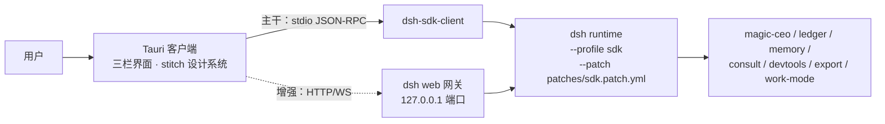

# 09 自有客户端架构

> 产品形态裁定见 [PRD-01 §2.1](../01-产品/PRD-01-Magic产品总览.md)：Magic 以自有 Tauri 桌面客户端交付，DSH 是后台执行底座。本文回答：客户端怎么连 runtime、哪些已验证、缺什么、怎么分期。不能重新定义产品语义。

## 1. 目标（一句话）

用自己的 Codex 风格界面驱动完整的 DSH runtime + Magic 插件，**不重写执行底座，不 fork DSH**。

## 2. 架构（双通道）

| 通道 | 用途 | 承载 |
|---|---|---|
| **SDK（主干）** | 发消息、收全量 session 事件流（对话、工具调用、CEO 派活、成员状态）、子代理谱系、模型路由与 maxTokens | `dsh-sdk-client` spawn 的 runtime 子进程，stdio JSON-RPC |
| **Remote（增强）** | 审批卡应答（`approval/request` + POST `/api/$events/result`）、文件树 / diff / 变更流（`remote.workspaceFiles`）、会话列表 | 客户端 HTTP+WS 连 `dsh web` 同一 runtime 的网关，cookie 认证 |

两者**驱动同一个 runtime**：日常运行时以 SDK 进程为主，Remote 网关用 `dsh web` 连接同一 `$DSH_HOME` 下同一 workspace 的会话（会话共享由 DSH session 持久化保证；**同会话双写并发的收口方式待技术核查**）。

## 3. 已验证事实（2026-09-16 实测/实读，证据为证）

| # | 结论 | 证据 |
|---|---|---|
| 1 | SDK 握手通过：外部进程可 spawn runtime（sdk profile + Magic 产品插件全载）并完成 `initialize` | `tools/sdk-smoke/smoke.mjs` 实跑输出 `handshake: ok`；插件日志 7 个 `plugin loaded` |
| 2 | CEO 事件全量进 `session.event` 流 | `plugins/magic-ceo/src/journal.ts:86-96`（`appendIgnorable` → `session.append`）→ `packages/core/session/src/index.ts:747-752`（append 即派发 `session/event`）→ `packages/sdk/server/src/server.ts:95-98`（全量转发给客户端） |
| 3 | SDK 协议面：3 请求 + 4 通知；**无取消、无审批应答、无文件访问** | `packages/sdk/protocol/src/types.ts:107-119`；`packages/sdk/protocol/README.md` Known Limitations（"Server→client requests are a dead capability … future approval flows"） |
| 4 | Remote 网关对非浏览器客户端开放：loopback Host 过 fence、token 换 cookie | `packages/client/connection/src/api-request-trust.ts:10-11`（注释明示 "Non-browser and remote clients pass the same fence"）；`browser-auth.ts:52-58, 240-282` |
| 5 | 审批闭环通道：WS `$events` waterfall 帧下行 + HTTP POST `/api/$events/result` 应答 | `packages/api/gateway/src/stream-protocol.ts:6-12, 51-57, 87-137`；`packages/api/remotes/src/remote-events.ts:16-36` |
| 6 | Remote wire 协议是静态手写校验，不要求客户端携带 Typert 生成物 | `packages/client/connection/src/rpc-schema.ts:35-40`；`packages/api/gateway/src/index.ts:936-951` |
| 7 | Remote 协议**无版本化承诺**——跟随 DSH 升级是长期成本 | `packages/client/connection/README.md`（无稳定性声明） |

## 4. 客户端技术栈（2026-09-16 裁定）

- **壳：Tauri 2**（用户裁定：多 agent 高并发场景，Rust 侧资源占用与并发模型更优）。`old-design` 分支的 Tauri 历史实现只作追溯，不构成约束，也不作为复用来源。
- **前端：React + TypeScript**，设计 tokens 直接从 `stitch_codex_ui_clone/*/DESIGN.md` frontmatter 生成 CSS 变量（颜色 / 字体 / 圆角 / 间距全套已定义）；`code.html` 是视觉参照，不直接作为代码引入。
- **SDK 客户端**：`@deepseek-ai/dsh-sdk-client` 在 Tauri 的 Node sidecar（或 Rust 侧 spawn 的 node 子进程）中运行；协议层很薄，必要时可按 `dsh-sdk-protocol` 的静态形状在 Rust 侧复刻（stdio 行帧 JSON-RPC）。
- **复用代码**：`plugins/magic-ceo-ui/src/team.ts`、`flow.ts`、`process-summary.ts` 是无 React 依赖的纯函数（事件折叠 / 画布布局），直接搬进客户端复用。

## 5. 界面区块映射（stitch 设计稿 → 数据通道）

| 设计稿区块 | 数据来源 | 状态 |
|---|---|---|
| 左栏会话树 / 项目 | Remote 会话列表（`api-session/*` 事件） | Remote 线 |
| 中栏对话流（计划卡 / 验证卡 / diff 卡） | SDK `session.event` | ✅ 已验证 |
| 中栏「执行计划 第N步/共M步」 | 代理=todo 事件；CEO=`ceo_plan` + `ceo/run-journal` | ✅ 已验证 |
| 中栏底部工作方式切换器 | `magic-work-mode`（客户端本地状态 + 提示词注入约定） | 接线 |
| 模型选择器 + token 计数 | SDK `initialize` 路由 + `token-meter` 事件 | 接线 |
| 右栏审查（diff） | Remote `workspaceFiles` changes 流 | Remote 线 |
| 右栏终端 | **缺口**：Remote 无终端通道；better-sidebar 的终端是私拉 pty | 缺口② |
| 右栏浏览器 | `dsh-builtin-browser`；Tauri 侧接 `electronViewHost` 等价缝或维持自托管窗口 | 缺口③（形态待定） |
| 审批卡 | Remote `approval/request` + `$events/result` | ✅ 证据完整 |
| CEO 团队画布 | SDK 事件流 + 复用 team.ts/flow.ts | ✅ 已验证 |

## 6. 缺口清单与补法

| 缺口 | 影响 | 补法（按优先序） |
|---|---|---|
| ① 会话列表（SDK 无 `session/list`） | 左栏会话树 | Remote 线获取；或客户端本地索引 session 目录（`$DSH_HOME/sessions`） |
| ② 终端面板 | 右栏终端 tab | 自建小型 Magic 插件经 ctx 缝暴露 pty（参照 better-sidebar 的 ptyManager）；或 M3 砍掉改用 shell 工具调用 |
| ③ 浏览器内嵌 | 右栏浏览器 tab | M3 决策：Tauri webview 内嵌 CDP 页面成本高时，维持 dsh-builtin-browser 自托管窗口（现状语义可用） |
| ④ 同会话 SDK+Remote 双通道并发写 | 状态一致性 | 待技术核查：确定"会话归属通道"规则（例如 Remote 只读 + 审批应答） |
| ⑤ runtime 生命周期管理 | 客户端开关时 runtime 跟随启停 | Tauri sidecar 托管 node 子进程；崩溃重启策略 |

## 7. 界面保真纪律（2026-09-16 用户裁定，防设计跑偏）

用户已完成高完成度的界面设计（`stitch_codex_ui_clone/`），客户端开发必须遵循以下硬规则：

1. **Tokens 机械提取**：颜色 / 字体 / 圆角 / 间距一律从该屏 `code.html` 的 Tailwind `theme.extend` 脚本化生成，禁止手工挑选近似值。**视觉权威是 `code.html` + `screen.png`**；`DESIGN.md` 正文（如 48px 收起、额外色值）不作为约束（2026-09-16 用户裁定）。frontmatter 色板与 HTML theme 一致时仅作对照，冲突以 HTML 为准。
2. **无出处不写组件**：界面上每个元素必须能在 `code.html` / `screen.png` 中指出出处。开发过程中想加设计稿里没有的东西，默认不加，先问用户。
3. **不做静默"改进"**：不得凭通用经验修改用户的设计选择（间距、圆角、配色、文案、布局）；对比发现差异时要么修正回设计稿，要么列出来问用户。
4. **像素对照**：每完成一个区块，用 `screen.png` 与实际渲染并排比对后再进入下一块。
5. **不确定不自造**：设计稿中存在但 Magic 尚无对应功能的入口（如「自动化工作流」「工作树」「技能扩展」），**画出入场但置灰 / 空态**，不虚构数据假装可用；该入口对应的功能是否做、先做什么，逐项问用户裁定。
6. **图标 / 特效 / 动画必须先问**（2026-09-16 用户补充裁定）：这三类内容最容易自作主张，一律停下来问用户确认后再做；设计稿里有明确出处的（如 Material Symbols 图标名）也要列清单确认。
7. **验收以设计稿为准**：M1 验收标准 = 与设计稿肉眼一致 + 数据真实（不是"开发者觉得好看"）。
8. **信息架构以用户裁定为准**（2026-09-16）：左栏导航去掉「工作树」「历史与审计」，「自动化工作流」改为「定时任务」（图标由用户提供，暂以 Material Symbols `timer` 占位）；置顶任务/项目/任务分组支持折叠收纳；左栏固定，仅列表内容超高时内部滚动。视觉基线仍是 `code.html`，区块内容与用户裁定冲突时以裁定为准。
9. **二轮风格裁定（2026-09-16，quiet 风格）**：用户提供的 Codex 侧栏组件（React txt）与新建任务 SVG 为左栏风格基准——新建任务/导航行不突出（无蓝底、无光晕、无 ⌘K 徽标，新建任务用 `edit_square` 图标）；仅 hover 有轻微背景（`surface-container-low`）、active 轻微缩放；去掉「项目」入口行（项目走会话树分组）；分组标题去大写、12.5px medium；行高 32px、圆角 8px、标签 14px medium、计数纯文本 tabular。stitch `code.html` 的高亮蓝按钮与光晕在左栏不再使用。
10. **三轮交互裁定（2026-09-16）**：所有行整行可点（会话行缩进改为行内边距）；置顶任务/项目/任务默认收起（收起带「›」箭头、展开无箭头）；项目标题悬浮显示 `···`/`+`（`+` 打开「创建项目」弹窗，弹窗含名称输入与源文件夹区，创建即入列表）；工作区行无展开箭头、点击折叠、悬浮显示「添加新会话」；会话行去掉 `chat_bubble` 图标与缩进竖线；工作区行的计数/待审核/ci 角标随 quiet 风格移除（待用户确认是否以别的方式回归）。
11. **四轮细节裁定（2026-09-16）**：任务行去掉前置图标；技能扩展去掉计数；**会话运行中动效**——运行中会话前置「书写笔」动画（用户提供的动效规范 `code.html` 方案一 Living Ink Pen：运笔微摆 + 笔尖发光 + 墨迹线，纯 CSS keyframes；**黑白配色、无「运行中」文字角标、无蓝色底**——笔在写即代表运行中，2026-09-16 二次确认），替代静态圆点；箭头位置修正为文字后（`分组名 ›`）。
12. **会话状态生命周期（2026-09-16，依据用户提供的会话状态流转规范 code.html）**：`running` 白笔运笔动效；`interrupted`（中断/异常停止）笔停下变红（静态 #ef4444，无运笔动画）；`completed` 绿色勾（「墨凝收笔与翡翠微绽」方案一：`bg-tertiary/20` 圆 + check，`emeraldBloom` 动画；**2026-09-17 裁定：改为 1.8s 无限循环，持续提醒用户已完成，点击会话行后提示消失**）；**点击完成/中断的会话行 → 前置提示整个去掉，变纯文本行**。不使用文字角标。
13. **项目文件夹 3D 开合动画（2026-09-17，迷你 3D 图标方案）**：项目行 folder 图标替换为 `Folder3DIcon`（用户提供的 FolderComponent txt 迷你版，18px，`motion/react` 驱动）：盖子 rotateX 关 -15°/悬浮 -40°/展开 -55°，弹簧物理 stiffness 120 / damping 14 同源，整体 -8° 倾斜（同日裁定：倾斜观感更好）；卡片飞出在行内尺寸下不可读，按用户确认省略。
14. **品牌独立与界面路线定案（2026-09-17）**：用户确认 Magic 是自有 agent 产品，DSH 仅作执行底座（"大脑"），产品界面与品牌不出现 DSH/DeepSeek；**否决**「Tauri 壳嵌入 DSH web 界面」与「把 Magic UI 做成 DSH web 客户端插件」两条捷径（技术核查：DSH web 无路由整页 SPA，无法按区块嵌入，组件与 cordis 运行时强耦合拆出≈重写）。底座升级按「评估选择性接入」处理：SDK 承诺面主干 + Remote 收敛适配层 + `tools/sdk-smoke` 回归。同日裁定：代码块/diff 展示采用用户提供的 `stitch_codex_ui_clone/UI/diff.txt` 浅色 CodeBlock 设计（照搬浅色，中栏+右栏统一，组件 `src/components/CodeBlock.tsx`）；文件类型图标（DSH 图元包 `dsh-client-ui-primitives` 全彩 SVG，证据 `plugins/dsh-better-sidebar/node_modules/.../lib/index.js:3191-3195,3374-3382`）待 SDK/Remote 接线时统一接入。

## 8. 里程碑

| 里程碑 | 内容 | 验收 |
|---|---|---|
| M1 垂直切片 | Tauri 壳 + 界面静态落地（stitch tokens）+ SDK 接线：发消息、对话流、执行计划卡、CEO 画布。**区块顺序按用户裁定（2026-09-16）：先做会话区（左栏），再做右栏，对话区（中栏）最后** | 会话区与设计稿肉眼一致；用 CEO 模式真实派 1 个活，画布与成员状态在自有 UI 全程可视 |
| M2 治理增强 | Remote 通道：审批卡、会话列表、diff 审查 | 审批卡在自有 UI 里完成一次 allow/reject 闭环 |
| M3 完整形态 | 终端决策、浏览器形态决策、打包分发、自动更新 | 安装包在干净 Windows 机器可用 |

## 9. 与现有资产的取舍

| 资产 | 去向 |
|---|---|
| `patches/web.patch.yml` | 保留：`dsh web` 调试通道 + Remote 网关宿主 |
| `patches/sdk.patch.yml` | 新建（2026-09-16）：自有客户端的 runtime 挂载清单（剔除 web 专属插件——它们 inject `webServer`/`webRuntime`，在 sdk profile 下 pending 导致启动失败） |
| magic-ceo-ui 的 host 侧注册（官方右坞 tab 等） | 保留于 web 调试通道；自有 UI 不依赖它 |
| vendored 客户端插件（better-sidebar / sidenote / 汉化 / univer） | 仅 web 调试通道使用；自有 UI 用不上其客户端半，host 半按需挂 |
| 环境备注 | pnpm 布局下 DSH 的 `node-addon-require-builtin` 平台包需在 DSH 仓 `node_modules` 手补 junction（`vendor/loader` 解析基路径问题），已修 |

## 10. 风险

1. **Remote 协议无稳定性承诺**（§3#7）：SDK 是公开承诺面，Remote 随时可能变。对策：SDK 承载一切核心语义，Remote 只做增强，接口收敛在一个适配层文件里。
2. **双通道会话一致性**（缺口④）：M2 动工前必须完成 §6④ 的技术核查。
3. **DSH 升级漂移**：base 对 0.1.5-rc.2；升级时 SDK/Remote 两侧都要回归 `tools/sdk-smoke`。
