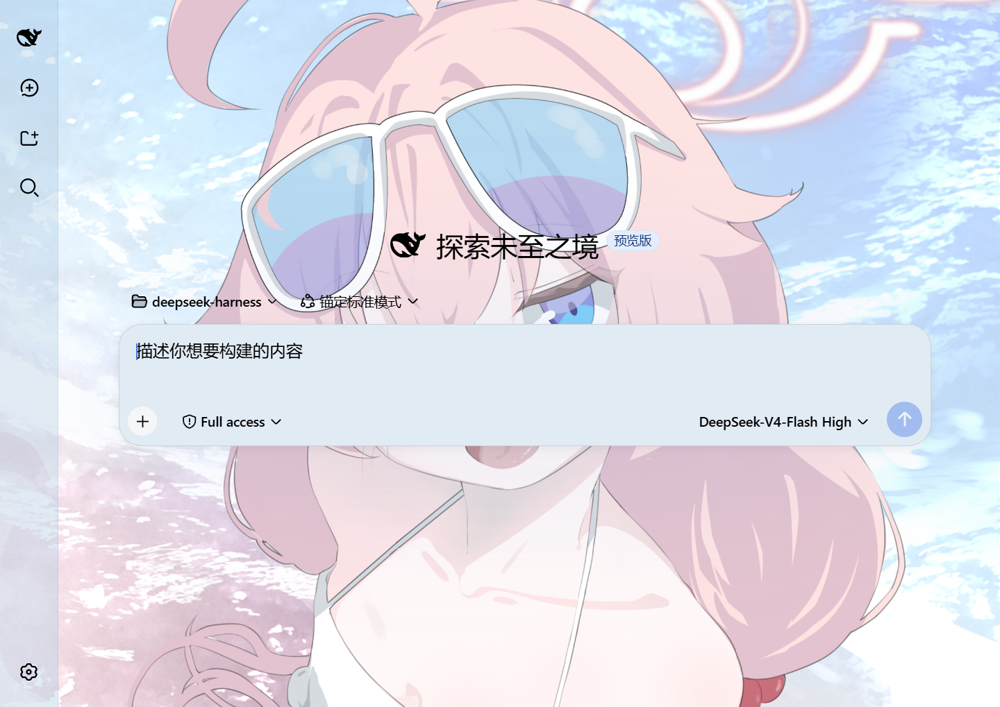
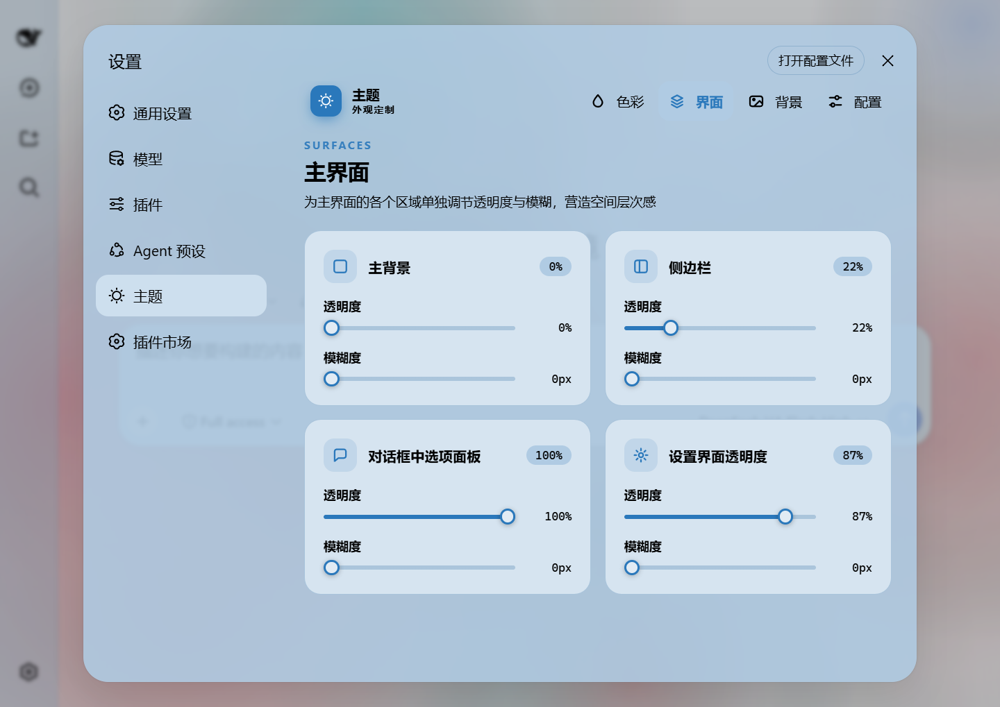
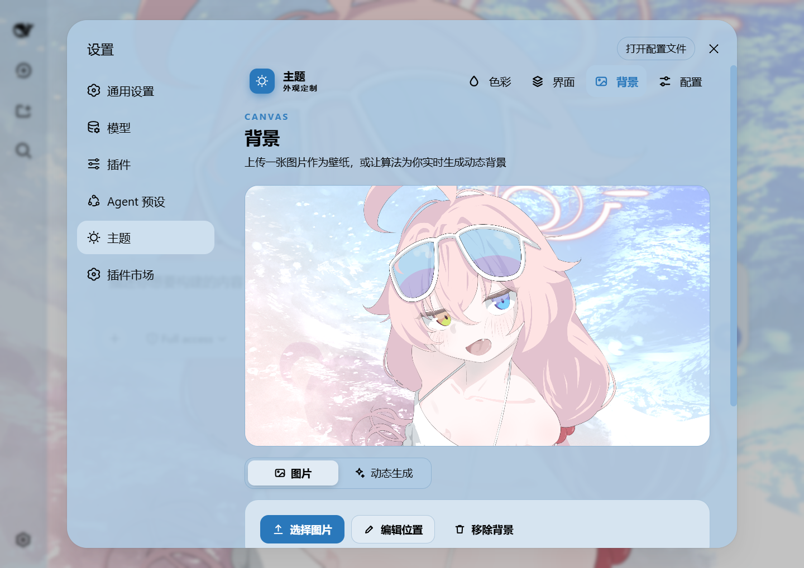
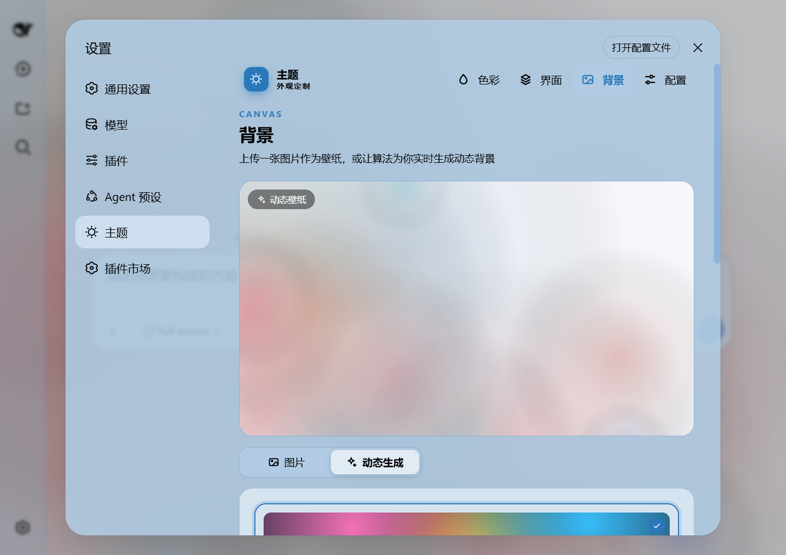
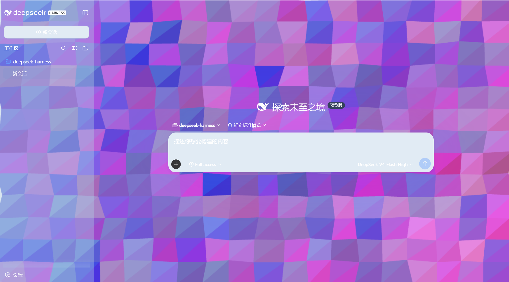
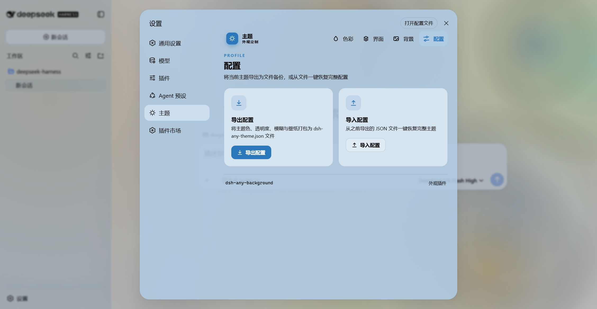

# dsh-any-background

<p align="center">
  <a href="https://github.com/Tkingxiao/dsh-any-background"></a>
  <a href="https://dsh.directory/plugins/tkingxiao/dsh-any-background"></a>
</p>

[English](README.md) | 中文

一个 **DeepSeek Harness** 外观插件，让你完全自定义 Web 端的主题色、背景壁纸，以及分部位精细的透明度与模糊度控制。

---

## 截图

<p align="center">
  
  <br/>
  <em>自定义主页 · 壁纸与主题色同时生效</em>
</p>

<p align="center">
  
  <br/>
  <em>主题色选择器 · PS 风格色轮 + 精确 HSL/RGB 输入</em>
</p>

<p align="center">
  
  <br/>
  <em>分部位透明度与模糊度 · 主背景、侧边栏、卡片、设置面板</em>
</p>

<p align="center">
  
  <br/>
  <em>背景编辑器 · 图片/视频壁纸支持拖动平移与滚轮缩放</em>
</p>

<p align="center">
  
  <br/>
  <em>动态生成背景 · 网格渐变 / Shader / 几何图案预设</em>
</p>

<p align="center">
  
  <br/>
  <em>动态生成背景 · 几何 低多边形模式预览</em>
</p>

<p align="center">
  
  <br/>
  <em>配置的导出和导入进行分享</em>
</p>

## 功能特性

- **PS 风格色轮** — 在色相环上选取色相，在内嵌方形中调整饱和度与明度，实时生成 30+ 个 CSS 设计令牌。
- **精确 HSL / RGB 输入** — 通过数值精确输入颜色，与色轮实时双向同步。
- **智能取色** — 一键从壁纸提取主题色：采样可见区域、量化像素、剔除灰色/近黑/近白，选出现量最大的鲜亮色。视频壁纸自动截帧参与取色。纯客户端完成。
- **吸管取色** — 在壁纸上悬停预览颜色，点击即可选为主题色。
- **背景壁纸** — 上传任意图片作为壁纸，在视口比例的编辑器中拖动平移、滚轮缩放。
- **视频壁纸** — 上传视频作为动态壁纸：静音循环播放、刷新不丢失（落盘持久化 + HTTP 流式播放，支持 Range seek）；自动截取一帧用于预览、主题色提取与位置编辑参考。
- **位置编辑器** — 图片与视频共用同一套编辑器：拖动平移、滚轮缩放、一键重置；图片与视频的位置状态各自独立保存，互不覆盖。
- **布局模式** — 适应 / 填充 / 拉伸 / 平铺 / 居中五种排布，图片与视频通用；「适应」模式下编辑器提交的构图在窗口缩放、跨屏移动后保持一致。
- **动态生成背景** — 支持网格渐变、Shader、几何图案，可调节扩散范围、色彩强度并锁定种子。
- **分部位界面透明度** — 主背景、侧边栏、卡片面板（含对话框周围的选项框/菜单）、输入框与控件（发送框、Cordis 插件面板）、设置面板与壁纸各自独立滑块。
- **分部位界面模糊度** — 每个界面部位可独立调整毛玻璃 `backdrop-filter` 模糊（0–60 px），并通过宿主的稳定选择器为发送框与 Cordis 面板提供真实背景模糊。
- **对话视图卡片** — 消息列表自动包裹为半透明卡片，轨迹页可整页调节透明度与模糊，让壁纸从内容后方透出来。
- **主题导出 / 导入** — 一键导出为自包含的 `dsh-any-theme.json`（配置 + 壁纸，视频以 data URL 内嵌），可随时导入还原。
- **文件持久化** — 所有设置保存到文件系统 `~/.dsh/.dsh-any-background-data/`，不再依赖 `localStorage`。
- **中英双语** — 完整的中英文界面，自动跟随语言设置。
- **主题守护** — 宿主重置主题后自动重新激活自定义主题。

## 近期优化

### v0.2.4

- **修复 dsh 0.1.5 持久化失效** — 主题/背景图的 RPC 通道改为在插件自身 `webServer` 作用域内直接注册为 prefix 路由（保留 Host/Origin 鉴权围墙），不再经由 `connection.rpc.handle`（其 effect 绑定到 connection 服务上下文，导致部分 0.1.5 宿主挂载失败）。此前请求落到 SPA 兜底并返回 405、从未写入磁盘的设置，现可正常持久化（0.1.2 与 0.1.5 均已验证）。
- **声明宿主版本兼容** — 新增 `engines.dsh: ">=0.1.2-rc.1"`，声明插件所支持的 DeepSeek Harness 宿主版本范围。
- **修复深色徽章令牌（issue #9）** — 深色预设下 `*-tertiary` 徽章表面（轨迹工具/上下文徽章、连接胶囊、计划 chip）与背景色过于接近，浅色标签文字不可读；现已对齐原生深色 800/900 阶令牌，亮色文字落在正确深色徽章上。

### v0.2.3

- **宽表格收进文本栏** — 当对话区透明度/模糊度被调大（边框因此可见）时，宽 Markdown 表格被收回文本栏宽度内、在边框处横向滚动，不再向右溢出裁切；边框不可见时不干预，保留 DSH 官方默认外扩行为。
- **网络 URL 壁纸** — 填入图片网址即可直接作为壁纸：插件下载图片并写入本地壁纸文件（替换原有持久化图片）。由于远程来源最终落到本地持久化文件，主题导出/导入无需任何额外适配：导出主题时内嵌图片数据，接收方无需访问原始网址也能还原。
- **深色主题下编辑器确认按钮清晰可见** — 背景编辑器「确认」按钮改为与「取消/重置」一致的实色表面 + 清晰边框 + 可读文字，不再使用半透明的主题色淡染，深色主题下不再看不清。
- **维护性清理** — 移除 `dsh.client.inject` 中未使用的 `@deepseek-ai/dsh-client-ui-renderer` 条目，并将插件自有 RPC 错误码对齐新版 harness 的命名规范。

## 安装

### 方式一：npm 安装（推荐）

```sh
dsh plugin --profile web add github:Tkingxiao/dsh-any-background
# 若已发布到 registry：
dsh plugin --profile web add dsh-any-background
```

然后启动：

```sh
dsh web
```

插件会出现在设置面板的 **“主题”** 分类中。

### 方式二：npx（无需全局安装）

```sh
npx @deepseek-ai/dsh plugin --profile web add github:Tkingxiao/dsh-any-background
npx @deepseek-ai/dsh web
```

### 方式三：本地构建（开发）

`lib/` 目录已提交，安装后无需构建。修改 `src/` 后重新构建：

```sh
git clone https://github.com/Tkingxiao/dsh-any-background.git
cd dsh-any-background
pnpm install
pnpm run bundle
pnpm dsh plugin --profile web add "dsh-any-background"
pnpm dsh web
```

## 兼容性

- **[`dsh web`](https://github.com/deepseek-ai/deepseek-harness)** — 同时兼容 npm 发布版与新版源码构建。插件会自动检测宿主携带的客户端模块表（新版 `@deepseek-ai/dsh-client-store` 或旧版 `@deepseek-ai/dsh-client-runtime`），并在运行时据此解析 `defineStore`。
- **[deepseek-harness-desktop](https://github.com/anywhere-labs/deepseek-harness-desktop)** — 支持

## Star History

[](https://www.star-history.com/?repos=Tkingxiao%2Fdsh-any-background&type=timeline&legend=bottom-right)

## 许可

MIT
